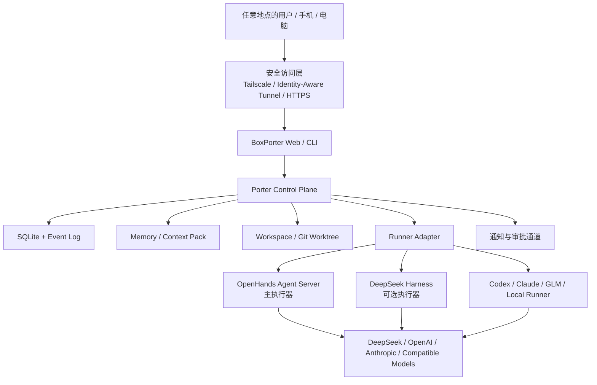
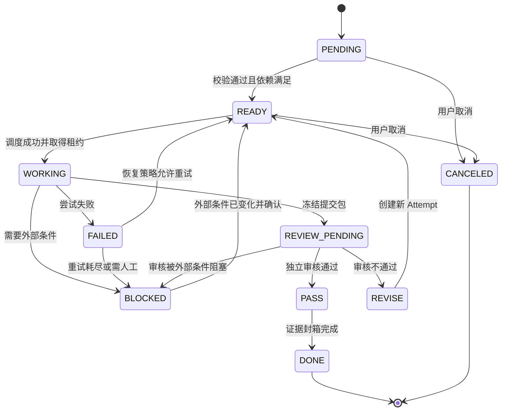
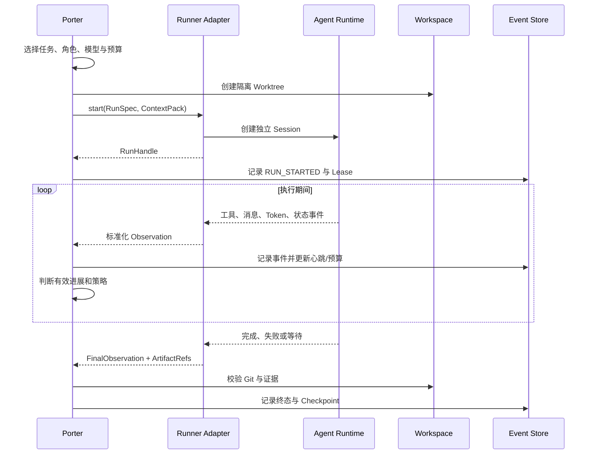
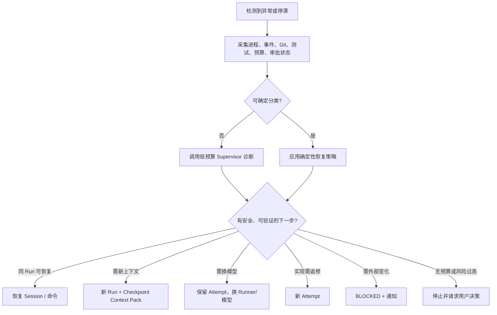
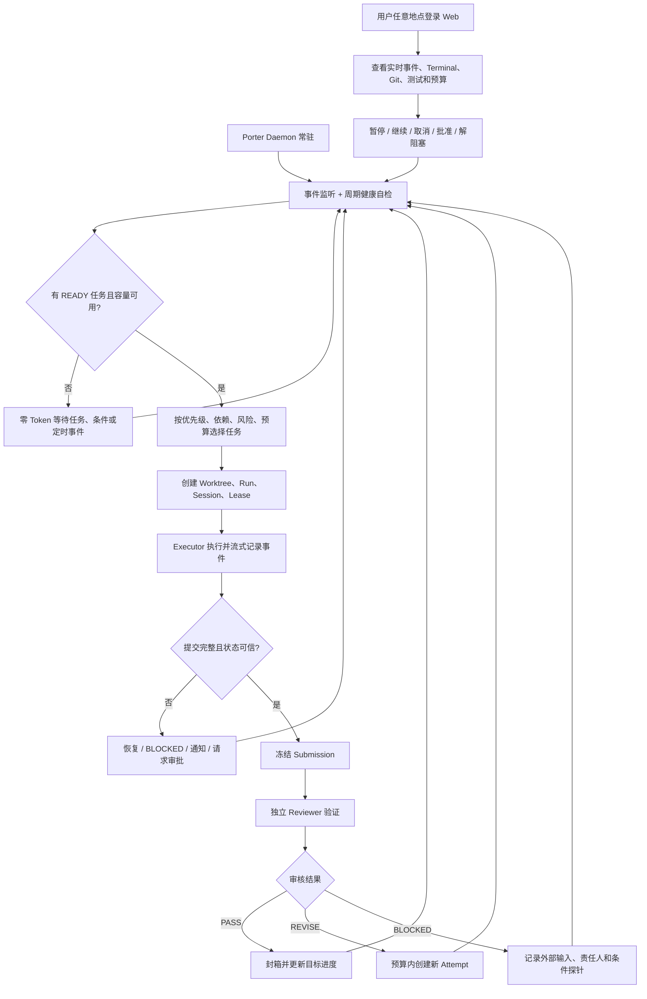
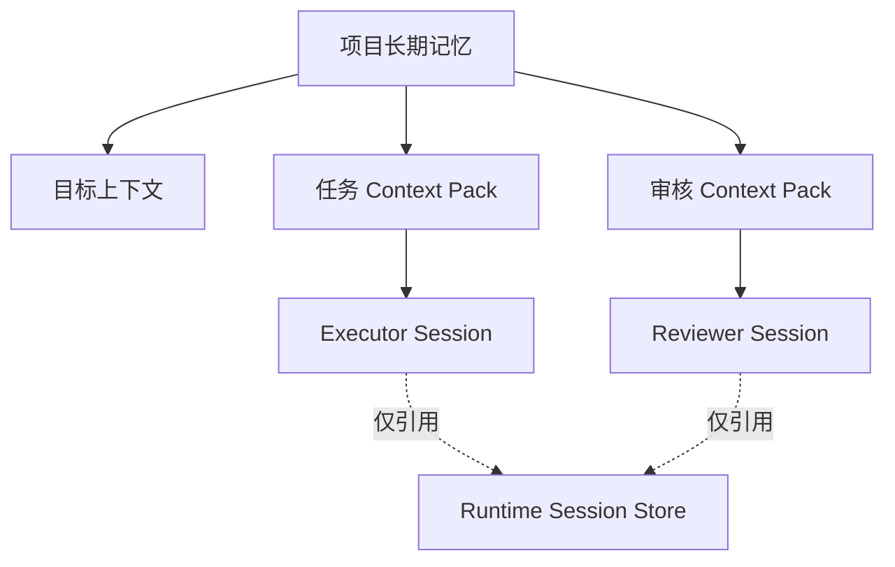
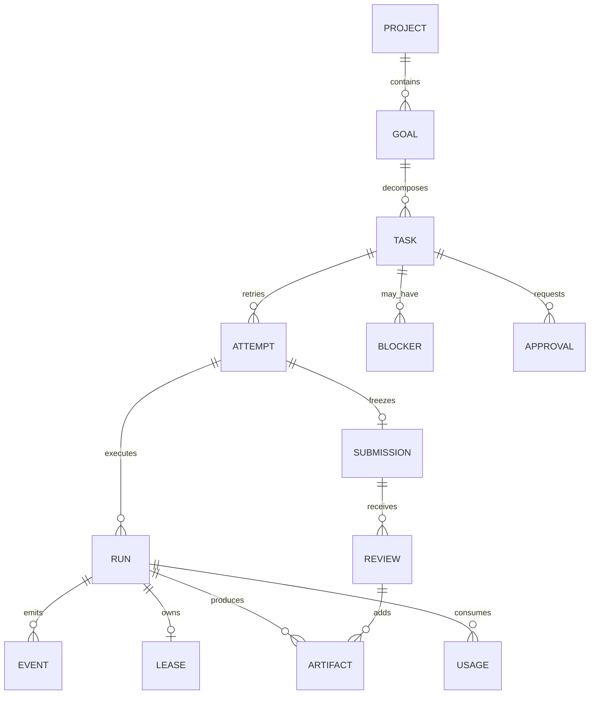
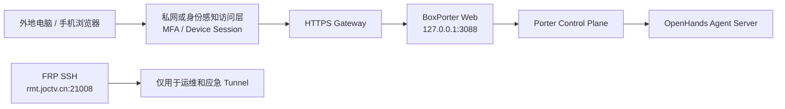

# BoxPorter（搬运猴）24×7 个人 AI 无人值守工作台完整规划书

> 文档版本：V1.1
> 文档状态：架构修订版 / 研发总纲 / 可持续补充
> 更新日期：2026-08-14
> 核心口号：**搬任务，不搬完整上下文。**
> 英文描述：**A human-readable task-box protocol and control plane for reliable multi-agent handoffs.**

---

## 0. 文档说明

### 0.1 文档用途

本文档是 BoxPorter 的产品、架构与研发总纲，供以下场景共同使用：

- 作为项目长期“宪法”，约束后续功能扩展不偏离核心定位；
- 作为 Codex、Claude、GLM、DeepSeek 等编码 Agent 的项目总上下文；
- 作为拆分 PRD、技术方案、数据库设计、接口设计和开发任务的基线；
- 作为审核 V1 是否真正达到“个人无人值守 AI 工作台”的验收依据；
- 作为本人后续补充想法、调整优先级和记录架构决策的主文档。

本文档不是一次性提示词，也不是最终代码实现说明。凡与实际仓库冲突之处，应先形成 ADR（架构决策记录），再更新本文档和代码。

### 0.2 当前基线

BoxPorter 当前已有一个轻量 Python 原型，采用人可读的 Markdown 任务箱、确定性 `tick`、执行/审核分离和通过后证据封箱。当前仓库公开定位是：在一台机器或可信共享文件系统上，用零 Token 的确定性协调减少无变化轮询，只在真实交接或失联时唤醒 Agent。

V1.1 明确新增三个产品约束：

1. 无人值守不等于夜间批处理。用户在白天或晚上离开电脑后，系统都必须继续工作；
2. 用户可以在任何地方通过安全 Web 登录查看实时过程并进行控制；
3. 可靠性是产品核心，不是后期优化项。浏览器断开、Agent 崩溃或 Mac mini 重启都不能导致任务状态丢失、重复执行或错误 PASS。

OpenHands Software Agent SDK / Agent Server 是 V1.1 推荐的主执行运行时。它已经提供面向软件开发的 Agent Loop、工具、隔离工作区、远程 Agent Server、HTTP API 和 WebSocket 事件，适合承担本地或容器化编码执行。DeepSeek Harness 保留为可选执行器；其官方仓库在本文更新时间仍标注为 **Developer Preview**，存在破坏性兼容风险。

因此本文档做出一个不可轻易改变的架构决定：

> **BoxPorter 保持独立、供应商无关的 24×7 任务协议与控制平面；OpenHands 作为 V1 主执行器，DeepSeek Harness、Codex、Claude、GLM 作为可替换 Runner，通过 Adapter 接入。BoxPorter 不重写 Agent Runtime，也不深度 Fork 任何上游项目。**

### 0.3 V1.1 架构修订摘要

| 修订项 | V1.0 | V1.1 决策 |
|---|---|---|
| 运行模式 | 偏夜间批处理 | 24×7 常驻、事件驱动的无人值守模式 |
| 用户入口 | 本地 Web 为主 | 任何地点安全登录 Web，实时查看和操作 |
| 执行底座 | DeepSeek Harness 优先 | OpenHands 主执行，DeepSeek Harness 可选 |
| 可靠性 | 分散在 WatchDog/恢复章节 | 服务、任务、结果、远程控制四层硬指标 |
| 浏览器生命周期 | 未明确 | 浏览器只是控制端，关闭或断网不影响执行 |
| 报告 | 晨报为主 | 实时过程 + 周期摘要 + 自定义时间段报告 |
| 远程访问 | FRP/SSH | 私网或身份网关优先，FRP 仅作受保护通道 |

### 0.4 参考基线

- BoxPorter 当前仓库：<https://github.com/wenlepan-lgtm/boxporter>
- OpenHands Software Agent SDK：<https://docs.openhands.dev/sdk/index>
- OpenHands Agent Server：<https://docs.openhands.dev/sdk/arch/agent-server>
- DeepSeek Harness 官方仓库：<https://github.com/deepseek-ai/deepseek-harness>
- LangGraph 持久执行参考：<https://docs.langchain.com/oss/python/langgraph/overview>
- Temporal 重试与幂等参考：<https://docs.temporal.io/develop/python/best-practices/error-handling>
- 各 Runner 的运行方式、稳定性和兼容状态以固定版本官方文档为准。

### 0.5 名词约定

| 名词 | 含义 |
|---|---|
| Goal / 目标 | 用户最终希望获得的可验证结果 |
| Task / 任务 | 可由一个 Agent 在有限时间内执行和验收的工作单元 |
| Box / 箱子 | 面向人的任务阶段视图，不等于数据库表或物理目录 |
| Run / 运行 | 某个角色对一个任务的一次执行尝试 |
| Attempt / 尝试 | 同一任务经历返修或失败后的版本序号 |
| Session / 会话 | Agent Runtime 保存的独立上下文和工具轨迹 |
| Lease / 租约 | 表明某 Run 仍拥有任务执行权的限时凭证 |
| Heartbeat / 心跳 | 延长租约并报告有效进展的机器事件 |
| Artifact / 产物 | 代码、补丁、测试结果、文档、截图等可验证输出 |
| Evidence / 证据 | 支持 PASS 结论的结构化、可追溯事实 |
| Submission / 提交包 | 某次实现提交给审核者的不可变快照及清单 |
| Review / 审核 | 独立角色对提交包执行的验收活动 |
| Porter | 搬运猴控制平面，负责调度、监督、恢复与交接 |
| Harness | 实际承载模型、工具、Session 和 Agent Loop 的执行运行时 |
| Runner | BoxPorter 可调度的具体执行后端，例如 OpenHands、DeepSeek Harness、Codex CLI |
| Away Mode | 用户不在电脑前时仍持续运行的无人值守策略，不限定白天或夜间 |
| Control Session | 用户通过 Web 查看和操作 BoxPorter 的登录会话，不等于 Agent Session |

---

# 1. 项目背景与问题定义

## 1.1 当前使用 AI 编码 Agent 的真实痛点

### 痛点一：人离开后，Agent 很快停止

典型场景不限定发生在晚上：

```text
10:00  用户提交一个较大任务
10:05  Agent 开始分析和修改
11:00  用户离开办公室，关闭浏览器或笔记本休眠
11:30  Agent 因报错、等待确认、上下文不足或自认为完成而停止
14:00  用户从手机或外地电脑登录 Web，发现任务只完成了部分工作
```

问题不只是 Token 套餐没有被利用，而是 Agent 的执行能力仍被绑定在人类持续在线这一条件上。

### 痛点二：停止不等于完成，完成也不一定真实

Agent 常见停止原因包括：

- 正常完成；
- 自认为完成，但没有跑测试；
- 工具调用失败后放弃；
- 等待权限或人工确认；
- 网络、模型、进程或运行时异常；
- 陷入重复修改、重复搜索或无效分析；
- 上下文过长，丢失原始验收标准；
- 输出了一份“完成报告”，但工作区没有对应代码变化。

如果系统只检查“进程还在不在”或“最近有没有文字输出”，就无法区分这些状态。

### 痛点三：多 Agent 交接成本高

把完整对话从执行者复制给审核者会产生四个问题：

1. 重复消耗 Token；
2. 审核者被执行者思路锚定，不再独立；
3. 机密信息、无关日志和失败尝试被扩散；
4. 真正的目标、约束和证据淹没在长上下文里。

BoxPorter 要搬的是任务的必要事实、提交快照和验收证据，而不是整段聊天历史。

### 痛点四：缺少独立、不可伪造的审核

同一个 Agent 修改代码后再说“已经通过”，不构成独立验收。真正的审核至少要保证：

- 审核者与执行者身份不同；
- Session 不同；
- 审核对象是冻结的提交快照；
- 审核者能自己运行验证命令；
- PASS 结论绑定提交哈希、测试结果和审核轨迹；
- 审核之后代码若变化，原 PASS 自动失效。

### 痛点五：无人值守容易变成无人控制

如果简单地让 Agent 无限重试，会出现：

- Token 和费用失控；
- 同一任务启动多个执行者，互相覆盖；
- 未经许可执行高风险操作；
- 失败后反复消耗资源但没有新增信息；
- 误把外部依赖阻塞当作可自动修复问题；
- 用户不在线时对生产环境或外部系统造成不可逆影响。

所以 BoxPorter 的目标不是“让模型永远运行”，而是“让系统在明确预算和权限边界内持续推进，并在无法安全推进时准确停下”。

## 1.2 核心问题定义

BoxPorter 需要回答七个问题：

1. 下一件真正值得唤醒 Agent 的事是什么？
2. 当前 Agent 是否在产生有效进展，而不仅是仍有输出？
3. Agent 停止后，系统应该继续、重试、返修、换模型、阻塞还是通知？
4. 如何在不搬运完整上下文的情况下把任务可靠交给下一角色？
5. 如何证明一个任务确实满足验收标准，而不是只生成了完成声明？
6. 用户在任何地点打开 Web 后，如何立即看到可信的实时状态并安全操作？
7. 浏览器、Agent、Daemon 或宿主机异常后，如何恢复且不重复副作用？

## 1.3 产品目标

### 近期目标

构建一个运行在个人 Mac mini 上的单机 AI 工作流控制平面，能够：

- 24×7 常驻运行，用户是否打开浏览器不影响任务；
- 管理多个项目、目标与任务；
- 使用四箱视图展示任务所处阶段；
- 调用不同 Agent Runtime 执行与审核；
- 监控租约、心跳、进程、文件、Git 和测试证据；
- 在有限策略内自动恢复；
- 形成可追溯的完成证据包；
- 通过安全 Web 提供远程实时查看、控制、审批和解阻塞；
- 按用户指定的时间范围生成工作摘要，而不是只生成晨报。

### 中期目标

- 多模型按能力、预算和可用性智能路由；
- 项目长期记忆与任务上下文自动压缩；
- 多工作区有限并发；
- 多用户设备安全登录、人工解阻塞和批准；
- Harness 插件化 UI 与独立控制台协同。

### 最终愿景

> 用户在任何时间提交目标后即可离开电脑；BoxPorter 在边界清晰、证据充分、风险受控的前提下持续组织 AI 团队工作。用户在任何地点登录 Web，都能看到真实过程、执行操作，并获得经过独立审核的工程成果、未解决风险和少量需要拍板的事项。

## 1.4 非目标

V1 明确不做：

- 不自研基础大模型；
- 不重写通用 Agent Loop、Shell、文件编辑器或浏览器工具；
- 不承诺跨数据中心、高吞吐分布式调度；
- 不承诺完全无人批准地操作生产环境；
- 不用完整聊天记录充当项目记忆；
- 不以猴子动画或看板视觉代替可靠的状态机；
- 不把“模型还在输出”视为有效进展；
- 不允许执行者给自己的提交判定 PASS。

---

# 2. 产品定位与核心原则

## 2.1 产品名称

- 中文名称：搬运猴
- 英文名称：BoxPorter
- 核心口号：搬任务，不搬完整上下文

“Box”代表结构化任务箱，“Porter”代表在阶段之间搬运任务、证据与责任的控制系统。

## 2.2 一句话定位

> BoxPorter 是面向个人 AI 研发团队的任务协议与控制平面，负责把目标拆成可执行任务，调度不同 Agent 生产和独立审核，并通过状态机、租约、恢复策略与证据门禁实现安全的无人值守工作。

## 2.3 三条核心理念

### 原则一：搬任务，不搬完整上下文

交接包只包含完成下一阶段所需的信息：目标、约束、输入引用、代码快照、验收标准和证据。完整 Session 留在原运行时存储中，仅保存引用和哈希。

### 原则二：Agent 负责生产，搬运猴负责管理

Agent 擅长分析、编码、测试和审核；Porter 负责决定谁在何时以什么权限工作、何时停止、如何恢复，以及什么条件下才算完成。

### 原则三：无人值守，但不能无人监管

无人值守意味着无需人持续盯屏；监管由确定性策略、预算、权限、证据门禁和异常升级共同承担。

## 2.4 补充工程原则

1. **确定性优先**：能用代码、状态和哈希判断的事情，不调用模型。
2. **状态单一真相**：数据库与事件日志共同形成可恢复的权威状态，不从 UI 文案推断状态。
3. **默认最小权限**：执行者和审核者按角色授权；高风险动作必须审批。
4. **提交不可变**：审核针对冻结快照；快照变化必须重新审核。
5. **失败可解释**：每次停止都要有机器可读原因、下一步和责任人。
6. **运行可替换**：Harness、Codex、Claude Code、GLM CLI 或本地模型通过统一 Runner 接口接入。
7. **上游隔离**：OpenHands、DeepSeek Harness 或其他 Runner 的变化只影响 Adapter，不影响 BoxPorter Core。
8. **人可读与机器可验并存**：Markdown 供人阅读，JSON/SQLite/哈希供机器校验。
9. **安全停止优于失控推进**：缺少必要授权或外部条件时进入 BLOCKED，不靠盲目重试消耗资源。

---

# 3. 行业现状、当前方案与技术决策

## 3.1 行业现状

成熟 Agent Runtime 已经普遍覆盖模型 Provider、工具调用、Session、Sandbox、插件、子 Agent 和 UI。BoxPorter 若重复建设这些能力，会把有限开发资源消耗在通用地基上。

但通用 Runtime 通常不替用户定义以下业务语义：

- 四箱阶段与人类可读工作流；
- 执行者与审核者强制隔离；
- 任务级预算和 24×7 无人值守策略；
- 提交证据不可变封箱；
- 外部阻塞与自动重试的区别；
- “有效进展”而不是“仍有输出”的判断；
- 面向个人研发流程的实时控制和周期摘要。

这些才是 BoxPorter 应积累的核心价值。

## 3.2 当前方案

当前 BoxPorter Python 原型已有：

- `pending / active / blocked / passed` 目录语义；
- Markdown 任务与报告；
- `PENDING → READY → WORKING → REVIEW_PENDING → PASS` 基础状态；
- `REVISE` 回路；
- 无变化时零模型调用的确定性 `tick`；
- 原子文件移动、`fsync` 和证据哈希；
- `executor_command` / `reviewer_command` 外部命令接口；
- 单工作区单 Active 任务约束。

需要补齐的关键缺口：

- 显式 Lease / Heartbeat，不能以任务文件 mtime 代替；
- 提交哈希绑定真实 Git Commit、Tree、Diff 和 Artifact；
- 代码级强制执行/审核身份与 Session 分离；
- 持久化 Run、Event、Budget、Approval 和 Recovery；
- 停止原因分类与恢复决策；
- 与浏览器生命周期解耦的常驻 Daemon；
- 可从任何地点安全访问的 Web 控制台、实时事件和远程操作；
- OpenHands 主 Runner Adapter；
- DeepSeek Harness、Codex、Claude、GLM 可选 Adapter；
- 24×7 Away Mode、周期摘要和通知；
- 可验证的项目记忆与 Context Pack。

## 3.3 推荐方案

```text
OpenHands Agent Server
    = V1 主 Agent 执行内核、隔离工作区和实时事件源

DeepSeek Harness / Codex / Claude / GLM
    = 可选 Runner

BoxPorter Core / 24×7 Porter Daemon
    = 稳定的任务协议、状态机、调度、监督、恢复、权限与验收控制平面

BoxPorter Web Gateway
    = 任意地点安全登录、实时观察、审批和控制

四箱系统
    = 面向用户的工作阶段视图

SQLite + Append-only Event Log
    = 状态与恢复依据

Git Worktree + Submission Manifest
    = 独立审核的不可变对象

不同 Role / Run / Session
    = 执行与审核隔离

Project Memory + Task Context Pack
    = 低损耗交接，不搬完整聊天
```

## 3.4 原因

- 保留现有 Python Core，利用已经验证的轻量任务协议；
- OpenHands 面向软件工程，已有本地/容器/远程工作区、HTTP API 和 WebSocket 事件，适合作为主执行层；
- DeepSeek Harness 官方仍处于开发预览期，应固定版本并作为可选 Runner 隔离适配风险；
- BoxPorter 继续保持供应商无关，不把产品命运绑定到单一模型或 Runtime；
- SQLite 足以支持 V1 单机一致性、事务和审计，避免过早引入分布式复杂度；
- Git 天然提供代码快照、差异和内容身份，是独立审核最可靠的工程边界。
- 常驻 Daemon 与 Web 客户端解耦后，用户关闭浏览器、换设备或临时断网都不影响后台执行。

## 3.5 风险

| 风险 | 影响 | 应对 |
|---|---|---|
| OpenHands 或 Harness API 变化 | Adapter 失效 | 固定版本；契约测试；只改 Adapter |
| Agent CLI 行为差异 | 无法统一恢复 | Runner 能力声明；Provider 专属策略 |
| 模型自报状态不可靠 | 错误推进 | 以进程、事件、Git、命令退出码和证据为准 |
| 无人时误操作 | 数据或外部系统损失 | 默认沙箱；审批门；禁止生产写操作 |
| 完整轨迹泄密 | 凭据与客户数据扩散 | Session 留原存储；封箱只保留引用、哈希和脱敏摘要 |
| SQLite 单机限制 | 无法横向扩展 | V1 明确单机；未来通过仓储接口迁移 PostgreSQL |
| 公网 Web 入口被攻击 | 控制权或代码泄露 | 私网/身份网关优先；MFA；HTTPS；审计；不裸露端口 |
| Mac mini 单点故障 | 整体暂时不可用 | launchd、UPS、健康监测、备份恢复；明确 V1 不做高可用集群 |

---

# 4. 总体架构

## 4.1 系统上下文图



## 4.2 分层职责

### Web / CLI 层

负责：

- 创建项目、目标和任务；
- 查看四箱、运行和证据；
- 在任意地点实时查看 Agent 消息、工具、Terminal、Git、测试、预算和有效进展；
- 人工批准、拒绝、停止、重试和解阻塞；
- 配置模型、预算、角色、Prompt 和无人值守策略；
- 展示周期报告、风险和系统健康；
- 网络断开后自动重连，并从服务端事件游标补齐过程。

不负责：

- 直接决定状态迁移；
- 直接操作 Agent 进程；
- 从前端缓存推断真实状态。
- 将浏览器连接当作任务执行生命周期；关闭页面不得停止 Run。

### Porter Control Plane

核心模块包括：

- Goal Planner：目标维护与任务拆分；
- State Machine：合法状态迁移；
- Scheduler：确定性调度与公平性；
- WatchDog：租约、心跳、进程和有效进展监测；
- Recovery Engine：失败分类与恢复决策；
- Policy Engine：权限、审批、预算、时间窗；
- Acceptance Gate：提交、审核、证据和 PASS 门禁；
- Event Store：所有决策的追加事件；
- Notification：阻塞、预算、健康告警和周期报告通知。
- Web Session & Audit：身份、设备会话、远程操作授权和完整审计。

### Runner Adapter 层

统一不同执行引擎，最小接口：

```python
class RunnerAdapter(Protocol):
    def capabilities(self) -> RunnerCapabilities: ...
    def start(self, spec: RunSpec) -> RunHandle: ...
    def inspect(self, handle: RunHandle) -> RunObservation: ...
    def send(self, handle: RunHandle, message: str) -> None: ...
    def checkpoint(self, handle: RunHandle) -> CheckpointRef: ...
    def stop(self, handle: RunHandle, reason: str) -> StopResult: ...
    def resume(self, checkpoint: CheckpointRef, spec: RunSpec) -> RunHandle: ...
    def collect_artifacts(self, handle: RunHandle) -> list[ArtifactRef]: ...
```

Adapter 必须返回机器可读状态，不能只提供终端文本。

### Agent Runtime 层

优先由 OpenHands Agent Server 负责；DeepSeek Harness 或其他 Runner 通过同一契约接入：

- 模型调用；
- 工具注册与调用；
- Agent Loop；
- Session 存储；
- Shell、文件、浏览器等工具；
- Sandbox；
- 原始轨迹与运行时事件。

### 数据与工作区层

- SQLite：业务状态、关系、预算、租约和索引；
- Event Log：可重放的状态变化和监督决策；
- Git Worktree：每个运行隔离的工程工作区；
- Artifact Store：证据、日志、测试输出和快照；
- Session Store：完整 Agent 轨迹，由各 Runtime 管理；
- Memory Store：项目事实、ADR、规范和任务上下文包。

## 4.3 推荐代码结构

```text
boxporter/
├── src/boxporter/
│   ├── core/
│   │   ├── boxes.py
│   │   ├── state_machine.py
│   │   ├── scheduler.py
│   │   ├── lease.py
│   │   ├── events.py
│   │   ├── evidence.py
│   │   ├── acceptance.py
│   │   └── recovery.py
│   ├── application/
│   │   ├── commands.py
│   │   ├── queries.py
│   │   └── services.py
│   ├── runners/
│   │   ├── base.py
│   │   ├── command.py
│   │   ├── openhands.py
│   │   ├── deepseek_harness.py
│   │   ├── codex.py
│   │   └── mock.py
│   ├── policies/
│   │   ├── permissions.py
│   │   ├── approvals.py
│   │   ├── budget.py
│   │   └── routing.py
│   ├── memory/
│   │   ├── project_memory.py
│   │   ├── context_pack.py
│   │   └── redaction.py
│   ├── storage/
│   │   ├── sqlite.py
│   │   ├── event_log.py
│   │   └── artifacts.py
│   ├── api/
│   │   ├── routes/
│   │   ├── websocket.py
│   │   ├── auth.py
│   │   ├── audit.py
│   │   └── schemas.py
│   ├── daemon.py
│   └── cli.py
├── web/
│   ├── src/pages/
│   ├── src/components/
│   └── src/api/
├── profiles/
│   ├── openhands-executor.yml
│   ├── openhands-reviewer.yml
│   ├── executor.cordis.yml
│   └── reviewer.cordis.yml
├── plugin/boxporter-dsh/
├── migrations/
├── tests/
│   ├── unit/
│   ├── integration/
│   ├── contract/
│   └── e2e/
└── docs/
    ├── adr/
    ├── protocol/
└── operations/
```

## 4.4 可靠性架构基线

V1.1 将“可靠”拆成四层硬要求，任何一层缺失都不能宣称无人值守可靠。

### 服务可靠

- Porter Daemon、Web API 和 Worker 由 launchd 独立守护，异常退出自动重启；
- 浏览器关闭、用户设备休眠或公网临时断开不影响后台 Run；
- Mac mini 重启后执行 reconciliation，根据数据库、Event、Lease、进程和 Checkpoint 恢复；
- SQLite 使用 WAL、事务和定期一致性快照；
- 磁盘、数据库、Runner、备份和远程入口均有健康探针；
- 运行日志轮转，关键事件追加存储，不能只存在内存或前端。

### 任务可靠

- 同一任务与角色同时最多一个有效 Lease；
- fencing token 阻止过期旧进程继续写入；
- 所有远程命令、状态迁移和外部副作用使用幂等键；
- 每个停止都有结构化原因；重试有限且不能原样无限循环；
- 长任务定期生成 Checkpoint；恢复不依赖完整聊天重新加载；
- BLOCKED 在外部条件未变化时零模型重试。

### 结果可靠

- Executor 与 Reviewer 的身份、Run、Session、权限和 Worktree 强制分离；
- PASS 必须绑定冻结的 Git Commit、Tree、Diff、测试退出码和证据哈希；
- 审核后任何受保护内容变化都会使原审核失效；
- PASSED 证据包可脱离 BoxPorter 离线校验；
- 完整聊天、模型自述或“任务已完成”文字不能单独作为完成证明。

### 远程控制可靠

- Web 使用 HTTPS、强认证和可撤销设备会话；高风险操作需要再次确认或批准；
- WebSocket/SSE 断线自动重连，并使用事件游标补齐遗漏事件；
- 前端只发送命令，服务端验证版本、权限、幂等键和合法状态迁移；
- 每次远程暂停、继续、取消、批准、返修和配置变更都写入审计日志；
- 用户在不同设备看到的是服务端同一真相，不以浏览器本地状态为准。

## 4.5 可用性边界

V1 是单 Mac mini 系统，目标是“可恢复的高可靠单机”，不是高可用集群。Mac mini 断电、家庭网络中断或硬件损坏期间，公网控制台可能不可用，但恢复后任务状态和证据不得丢失或重复。建议配置 UPS、自动开机、健康通知和加密备份；需要跨主机无缝接管时再升级 PostgreSQL 与 Temporal/等价持久工作流平台。

## 4.6 V1 可靠性目标

以下是工程验收目标，不等于对家庭供电和公网线路提供商业 SLA：

| 指标 | V1 目标 |
|---|---|
| Control Plane 可用性 | 在 Mac mini 与网络可用期间，月度 ≥ 99.5% |
| Daemon 异常退出恢复 | 60 秒内由 launchd 重新启动 |
| 宿主重启后的 reconciliation | 5 分钟内完成并恢复可操作状态 |
| 已提交事务状态丢失 | 0；不得因浏览器或 Agent 崩溃回退 |
| 同任务同角色重复有效 Lease | 0 |
| Web 实时事件 | 正常网络下 P95 延迟 ≤ 2 秒 |
| Web 断线恢复 | 网络恢复后 10 秒内重连，事件缺口为 0 |
| PASS 证据完整性 | 100% 可重算哈希；任一不一致阻止 PASS |
| 高风险远程操作审计 | 100% 记录操作者、目标、结果和时间 |
| 在线数据备份 RPO | ≤ 24 小时；PASSED 证据在封箱后立即进入备份队列 |
| 灾难恢复 RTO | 有可用备份时 ≤ 2 小时恢复控制平面与已封箱证据 |

若连续测试不能达到以上目标，应缩小并发和功能范围，不应通过降低审核或权限门槛来“提高可用性”。

---

# 5. 四箱系统详细设计

## 5.1 四箱的正确含义

四箱是面向人的阶段视图，不是四个互相独立的数据孤岛。

```text
PENDING → ACTIVE → PASSED
             ↓
          BLOCKED
```

| 箱子 | 目的 | 可进入条件 | 可离开条件 |
|---|---|---|---|
| 待处理箱 PENDING | 保存尚未被执行的任务 | 任务创建、返还待修订 | 依赖满足、校验通过、被调度 |
| 处理中箱 ACTIVE | 当前正在执行、返修或审核 | 获得执行租约 | PASS、外部阻塞、取消、退回 |
| 阻塞箱 BLOCKED | 等待真实外部变化 | 自动化无法安全解决 | 外部条件变化并经确认 |
| 已通过箱 PASSED | 保存通过审核的不可变证据包 | Acceptance Gate 全部通过 | 原则上不返回；变更应建新任务 |

`REVIEW_PENDING` 和 `REVISE` 是 ACTIVE 内部状态，不应再创建第五、第六个物理箱子。

## 5.2 目标箱（产品视图）

目标箱不是当前四个任务阶段目录之一，而是高于任务箱的产品视图。它回答“最终要完成什么”。

目标字段：

```yaml
goal_id: hotel-voice-v3
project_id: hotel-ai
title: 完成酒店 AI 语音助手 V3
background: 当前版本远场唤醒和连续对话不稳定
outcome: 可部署并通过现场验收的 V3 版本
success_criteria:
  - 5 米环境达到约定唤醒率
  - 支持连续对话
  - 支持电视控制
  - 回归测试通过
milestones: []
progress: 0.70
risks: []
owner: user
status: active
```

目标完成度不能由 Agent 主观填写，应由里程碑权重和已 PASS 任务计算，并允许用户最终确认。

## 5.3 任务箱

任务必须小到能在一个合理时间窗内执行和验收。推荐单任务目标时长 30 分钟至 4 小时；超过 8 小时应优先拆分。

任务最低字段：

```yaml
schema: BOXPORTER_TASK_V2
task_id: fix-login-loop
project_id: app
goal_id: stable-auth
title: 修复登录重定向循环
objective: 定位根因、修复并增加回归测试
state: READY
priority: high
workspace: /absolute/path/to/project
base_commit: abc123
dependencies: []
inputs: []
constraints: []
acceptance_criteria:
  - 根因被记录
  - 登录成功后不再重复跳转
  - 新增回归测试
  - 原有登录测试通过
required_evidence:
  - changed_files
  - git_diff
  - test_commands_with_exit_codes
  - remaining_risks
executor_profile: boxporter-executor
reviewer_profile: boxporter-reviewer
attempt: 1
max_attempts: 4
timeout_seconds: 7200
token_budget: 200000
risk_level: medium
created_at: 2026-08-14T22:00:00+08:00
```

任务进入 READY 前必须校验：

- 目标明确；
- 工作区存在；
- 基线版本可解析；
- 验收标准可验证；
- 依赖任务已满足；
- 风险和权限级别已确定；
- 所需凭据只以引用存在，不含明文；
- 预算、超时和最大尝试次数已设置。

## 5.4 研发箱

研发箱承载一个或多个受控执行 Run，主要职责：

- 创建独立 Worktree 或确认安全工作区；
- 生成 Executor Context Pack；
- 按策略选择 Runner、模型和权限；
- 启动 Session 与 Lease；
- 接收运行时事件并记录有效进展；
- 执行代码、测试和静态检查；
- 生成结果报告、验证报告和 Submission Manifest；
- 在提交审核前冻结快照。

研发箱产出：

```text
代码变化
Git commit / tree / patch
result.md
verify.md
artifact-manifest.json
submission-manifest.json
executor-run.json
trajectory.ref.json
```

执行者没有 PASS 权限，只能声明 `SUBMITTED` 或 `BLOCKED_REQUESTED`。

## 5.5 审核箱

审核箱不是阅读执行者总结，而是独立验证冻结提交。

强制隔离条件：

```text
executor_run_id        != reviewer_run_id
executor_session_id    != reviewer_session_id
executor_identity      != reviewer_identity
executor_worktree      != reviewer_worktree
```

推荐审核权限：

- 提交代码只读；
- 可在隔离环境运行测试；
- 可读取任务、提交清单和必要项目规范；
- 默认看不到执行者完整聊天；
- 只允许写审核报告和新增审核证据；
- 不允许悄悄修改被审核代码后再 PASS。

审核结果：

| 结果 | 含义 | 下一步 |
|---|---|---|
| PASS | 所有强制验收门通过 | 移入 PASSED 并封箱 |
| REVISE | 实现可修复但不满足标准 | 新 Attempt，返回研发 |
| BLOCKED | 审核所需外部条件不存在 | 进入 BLOCKED |
| INVALID_SUBMISSION | 提交清单或哈希失效 | 作废审核并重新提交 |

`INVALID_SUBMISSION` 是审核事件原因，不作为长期任务状态，避免状态膨胀。

## 5.6 已通过证据包

推荐结构：

```text
passed/<task-id>/<submission-sha>/
├── task.md
├── result.md
├── verify.md
├── executor.md
├── reviewer.md
├── submission-manifest.json
├── artifact-manifest.json
├── commit.json
├── trajectory.ref.json
├── review-evidence/
└── manifest.json
```

完整 Session 不复制进证据包。`trajectory.ref.json` 只保存引用、哈希、存储位置和脱敏状态。

---

# 6. 状态机设计

## 6.1 任务状态机



说明：四箱视图与细粒度状态映射如下：

| 细粒度状态 | 箱子 |
|---|---|
| PENDING、READY | PENDING |
| WORKING、REVIEW_PENDING、REVISE、FAILED（可恢复） | ACTIVE |
| BLOCKED | BLOCKED |
| PASS、DONE | PASSED |
| CANCELED | 归档，不进入 PASSED |

## 6.2 Run 状态机

```text
CREATED
  → STARTING
  → RUNNING
  → CHECKPOINTING
  → SUCCEEDED

异常分支：
RUNNING → WAITING_APPROVAL
RUNNING → STALLED
RUNNING → TIMED_OUT
RUNNING → CRASHED
RUNNING → CANCELED
```

任务状态与 Run 状态必须分离。一个任务可经历多个 Run；单个 Run 崩溃不代表任务终止。

## 6.3 合法迁移规则

每次迁移必须满足：

1. 当前状态与预期状态一致，采用乐观锁或事务避免并发覆盖；
2. 触发者有权限；
3. 前置条件通过；
4. 事件已追加；
5. 数据库状态与箱子投影在同一事务或可恢复流程内更新；
6. 非幂等副作用具有 operation id，重复消费不会重复执行。

## 6.4 禁止迁移

- WORKING 直接到 DONE；
- 执行者直接把任务标为 PASS；
- 未冻结提交时进入 REVIEW_PENDING；
- 审核 Session 与执行 Session 相同时 PASS；
- 审核后的 Git Tree 与提交清单不一致时 PASS；
- BLOCKED 在外部条件未变化时自动高频重试；
- DONE 原地修改证据；如需变化必须创建新任务或新版本。

---

# 7. Agent 生命周期与角色模型

## 7.1 生命周期



## 7.2 核心角色

### Planner

- 将目标拆成任务；
- 明确依赖、风险、预算和验收；
- 不执行代码，不判 PASS；
- V1 可先由用户或单次 Agent 辅助完成。

### Executor

- 定位根因；
- 在授权工作区修改；
- 执行验证；
- 记录事实、变更和剩余风险；
- 生成可审核提交。

### Reviewer

- 独立读取任务和冻结提交；
- 自行运行关键验证；
- 检查根因、生产适用性、行业实践和隐藏风险；
- 只能 PASS、REVISE 或 BLOCKED，不能暗改提交。

### Porter Supervisor

- 不是通用聊天角色；
- 读取机器状态和策略；
- 调度、停止、恢复、升级；
- 默认由确定性代码执行，只有模糊诊断才调用监督模型。

### Human Owner

- 定义目标和高风险边界；
- 处理外部阻塞；
- 批准生产、凭据、付费或破坏性操作；
- 对重大架构取舍和最终目标完成进行拍板。

## 7.3 Prompt 边界

不同角色使用独立 Prompt 模板：

- `planner.system.md`
- `executor.system.md`
- `reviewer.system.md`
- `supervisor.system.md`
- `morning_report.system.md`

Prompt 版本必须记录到 Run，修改 Prompt 不影响历史可追溯性。

---

# 8. WatchDog 与有效进展检测

## 8.1 为什么不能只看进程或输出

以下情况进程仍在，但没有有效进展：

- 反复读取同一文件；
- 反复生成相同补丁；
- 测试命令卡死；
- 模型持续解释但工作区无变化；
- 工具错误后不断重试；
- 等待审批却没有显式上报。

以下情况暂时没有文本输出，但仍在有效工作：

- 长时间编译；
- 测试套件运行；
- 大型依赖安装；
- 本地索引或静态分析。

WatchDog 必须综合多信号判断。

## 8.2 显式 Lease

示例：

```json
{
  "task_id": "fix-login-loop",
  "role": "executor",
  "run_id": "run_01J...",
  "session_id": "executor_fix-login_attempt_2",
  "runner": "deepseek-harness",
  "pid": 12345,
  "owner_instance": "porter-macmini-01",
  "started_at": "2026-08-14T22:10:00+08:00",
  "heartbeat_at": "2026-08-14T22:12:20+08:00",
  "lease_expires_at": "2026-08-14T22:17:20+08:00",
  "fencing_token": 42
}
```

关键要求：

- Lease 由数据库事务创建；
- 同任务同角色同时只能有一个有效 Lease；
- 采用 fencing token 防止过期旧进程继续写入；
- 心跳来自 Runner 事件或 Porter 采样，不能通过 touch 任务文件伪造；
- Lease 过期只触发诊断，不直接无脑启动第二个执行者。

## 8.3 有效进展信号

正向信号：

- 新增或修改与任务相关的文件；
- Git diff 或 Tree 发生合理变化；
- 新测试从失败变为通过；
- 新定位到根因证据；
- 完成一个明确子步骤；
- 产生新的、非重复工具结果；
- 更新结构化检查点；
- 编译或测试进程有资源活动且未超出预期时长。

负向信号：

- 相同工具调用和参数重复多次；
- 相同错误指纹重复；
- 同一文件在少量内容之间来回变化；
- Token 持续增加但 Git、测试和检查点不变；
- CPU、IO 和事件均长期静止；
- 已经请求审批却仍继续尝试受限动作；
- 进程退出但 Run 未报告终态。

## 8.4 进展评分建议

V1 不需要复杂模型，可采用可解释评分：

```text
progress_score =
    + 3 * new_checkpoint
    + 3 * acceptance_test_improved
    + 2 * relevant_git_change
    + 2 * new_root_cause_evidence
    + 1 * non_repeated_tool_result
    - 2 * repeated_error
    - 2 * repeated_tool_call
    - 3 * oscillating_diff
    - 4 * no_signal_window
```

低分只表示需要诊断，不能单独作为杀进程依据。停止前还要检查当前是否为长时命令、是否持有有效子进程、是否接近自然完成。

## 8.5 监控窗口

推荐默认值，可按项目配置：

| 项目 | 默认值 |
|---|---:|
| 心跳间隔 | 30 秒 |
| Lease 有效期 | 5 分钟 |
| 无新有效进展提醒 | 10 分钟 |
| 可疑停滞诊断 | 20 分钟 |
| 普通任务硬超时 | 2 小时 |
| 单次自动恢复上限 | 2 次 |
| 同错误指纹重复上限 | 3 次 |

---

# 9. 自动恢复与故障策略

## 9.1 故障分类

| 类别 | 例子 | 默认策略 |
|---|---|---|
| 瞬时运行时故障 | 网络断开、模型 5xx、临时限流 | 退避后恢复同 Attempt |
| 进程崩溃 | CLI 异常退出、宿主重启 | 从 Checkpoint 恢复或新 Run |
| 工具故障 | 测试命令不存在、依赖安装失败 | 允许一次诊断；重复则阻塞/返修 |
| 逻辑停滞 | 重复循环、无有效进展 | 暂停、摘要、重规划或换模型 |
| 上下文退化 | 忘记目标、输出偏离 | 新 Session + 紧凑 Context Pack |
| 权限/审批 | 需要 sudo、生产写入、外部发送 | WAITING_APPROVAL / BLOCKED |
| 外部依赖 | 设备离线、凭据缺失、第三方服务不可用 | BLOCKED，条件变化前零模型重试 |
| 预算耗尽 | Token、费用、时间超过限制 | 停止并请求扩大预算或拆分 |
| 验收失败 | 测试失败、审核 REVISE | 新 Attempt 返回 Executor |
| 证据失效 | 审核前后代码变化 | 作废提交并重新封装 |

## 9.2 恢复决策流程



## 9.3 重试规则

- 使用指数退避并加入抖动；
- 相同错误指纹连续出现三次，不再原样重试；
- 重试必须产生新的恢复假设或外部条件变化；
- 切换模型前保存最小 Checkpoint，不复制全部失败聊天；
- 每次恢复增加 recovery_count；
- 超过任务的恢复上限进入 BLOCKED；
- 任何恢复不得绕过原权限和预算。

## 9.4 Checkpoint 内容

```json
{
  "task_id": "...",
  "attempt": 2,
  "run_id": "...",
  "objective": "...",
  "completed_steps": [],
  "current_hypothesis": "...",
  "verified_facts": [],
  "failed_approaches": [],
  "workspace_ref": {"head_commit": "...", "git_tree": "..."},
  "next_safe_actions": [],
  "open_questions": [],
  "artifact_refs": [],
  "created_at": "..."
}
```

Checkpoint 必须是事实与下一步摘要，不能包含模型内部思维链。

---

# 10. 24×7 无人值守与 Away Mode

## 10.1 目标

无人值守模式不限定夜间。只要任务达到 READY，BoxPorter 就可按策略持续推进；用户是否在电脑前、是否打开浏览器、使用手机还是外地电脑，都不改变任务生命周期。

Away Mode 的目标是：

- 用户离开后任务继续；
- 用户随时登录 Web 能看到真实过程；
- 需要人工时准确暂停并通知，而不是假装完成；
- 用户从 Web 处理阻塞后，任务从可靠 Checkpoint 继续；
- 在预算、权限和风险边界内持续工作，而不是最大化模型调用量。

## 10.2 常驻执行流程



## 10.3 运行策略

系统提供三种策略，而不是把白天和夜间写死：

| 模式 | 行为 | 适用场景 |
|---|---|---|
| SUPERVISED | 执行持续运行，高风险步骤主动请求批准 | 用户在线但不持续盯屏 |
| AWAY | 用户不在场，允许低/中风险任务在预算内自动执行与审核 | 白天外出、出差、睡眠 |
| PAUSED | 不启动新 Run；已有 Run 按策略检查点后暂停 | 维护、费用控制、紧急停止 |

模式切换只改变调度和审批策略，不能删除状态、绕过审核或让过期 Run 恢复写权限。

## 10.4 无人值守准入条件

任务必须同时满足：

- 状态为 READY；
- 依赖满足；
- 风险不高于当前 Away Policy 允许级别；
- 不需要未经批准的生产环境写权限；
- 不需要不可逆外部操作；
- Token、费用、时间和并发预算充足；
- 工作区干净或已有明确隔离策略；
- 验收标准可自动执行至少一部分；
- 所需凭据已通过安全引用提供；
- 主 Runner 和备用 Runner 健康检查通过；
- 当前任务不存在有效的同角色 Lease；
- 远程控制面异常不会导致任务失去服务端监督。

## 10.5 默认禁止动作

无论白天或晚上，只要用户未对精确动作授权，默认禁止：

- 删除大范围数据；
- 推送或部署生产；
- 发送外部邮件、消息或提交付费订单；
- 修改路由器、防火墙或系统级安全设置；
- 使用未授权的 sudo；
- 自动扩大 Token 或费用预算；
- 绕过测试、审核或证据门；
- 在原用户未提交的脏工作树上覆盖修改；
- 因用户暂时无法连接 Web 而降低安全门槛。

## 10.6 实时查看与远程操作

用户登录 Web 后可以看到：

- 当前任务、Attempt、Run、角色、Runner、模型和 Session；
- Agent 对用户可见的消息和结构化计划；
- 工具调用、Terminal、命令退出码和长命令进度；
- Git 文件变化、Diff、Commit 和 Worktree；
- 测试进度、验证证据和 Reviewer 结论；
- Lease、最后心跳、有效进展、Token、费用和剩余预算；
- 停止、停滞、等待审批或 BLOCKED 的准确原因。

用户可执行：

- 暂停、继续和安全取消；
- 请求立即 Checkpoint；
- 批准或拒绝精确的高风险动作；
- 提供缺失输入并解除 BLOCKED；
- 要求 REVISE、切换 Runner 或降低/扩大任务预算；
- 查看和下载提交证据包。

远程命令必须经过服务端版本检查、状态机、权限、幂等和审计，不允许浏览器直接控制子进程。

## 10.7 周期报告

“晨报”只是一个默认模板。系统应支持用户选择任意时间范围，例如离开办公室的 3 小时、一个工作日、整夜或一周。

```text
统计窗口：2026-08-14 10:00–14:00

已通过：
- TASK-101 修复登录循环，提交 xxx，审核者 yyy

执行中：
- TASK-110 Executor 正常，最近有效进展 2 分钟前，预算 46%

返修中：
- TASK-104 第 2 次尝试，未满足标准：...

阻塞：
- TASK-107 需要 Android 设备上线；条件探针每 15 分钟运行，不调用模型

资源：
- 总 Token / 费用 / 运行时长
- 按项目、模型、角色拆分

需要你处理：
1. 是否批准读取指定私有日志？
2. 是否接受某架构取舍？
```

周期报告应主要由结构化事件生成；仅在需要自然语言归纳时调用一次低预算模型。

---

# 11. 调度、模型路由与 Token 预算

## 11.1 确定性调度优先

任务排序建议：

```text
score =
  priority_weight
  + goal_criticality
  + dependency_unblock_value
  + aging_bonus
  + expected_night_fit
  - risk_penalty
  - estimated_cost_penalty
```

不能只按“最新任务”或“最贵模型”调度。

## 11.2 模型能力档案

每个模型/Runner 保存：

- Provider 与模型名；
- 支持工具、图像、长上下文、子 Agent 等能力；
- 平均启动延迟；
- 最近成功率；
- 任务类型表现；
- 输入/输出 Token 成本；
- 并发和速率限制；
- 可用时间或套餐窗口；
- 数据和隐私等级；
- 推荐角色：Planner / Executor / Reviewer / Supervisor。

## 11.3 路由策略

- 小型确定性改动：优先低成本快速模型；
- 跨模块架构或复杂根因：优先强推理模型；
- 审核不能仅因便宜而使用明显弱于执行者的模型；
- 同一模型可承担不同任务角色，但同一提交的执行与审核必须是不同身份和 Session；
- 模型不可用时，按预配置 fallback 链切换；
- fallback 不得改变权限和验收标准。

## 11.4 预算层级

```text
全局日预算
  └── 项目预算
       └── 目标预算
            └── 任务预算
                 └── Attempt / Run 预算
```

同时限制：

- Token；
- 估算费用；
- 墙钟时间；
- 最大工具调用数；
- 最大恢复次数；
- 最大并发数。

预算达到 80% 时预警，100% 时停止；除非用户提前设置允许的弹性区间。

## 11.5 零 Token 原则

以下动作不应调用模型：

- 检查是否有新任务；
- 读取状态和依赖；
- 判断 Lease 是否过期；
- 计算哈希；
- 检查 Git 是否变化；
- 读取命令退出码；
- 检查外部条件的机器探针；
- 按既定规则迁移状态；
- 生成结构化统计。

---

# 12. 上下文与记忆系统

## 12.1 记忆分层



### 长期项目记忆

保存稳定事实：

- 产品定位；
- 架构与 ADR；
- 编码规范；
- 构建和测试方法；
- 环境与设备说明；
- 已知风险；
- 关键目录与模块关系；
- 已通过任务产生的新事实。

### 目标记忆

保存目标的阶段、里程碑、依赖和决策，不保存每次 Agent 对话。

### 任务短期上下文

只服务当前 Attempt：

- 目标与验收；
- 必要文件引用；
- 已验证事实；
- 当前工作区状态；
- 前次返修意见；
- 禁止重复的失败方法；
- 预算和权限。

### Session 轨迹

完整消息、工具调用和 Runtime 事件留在 Runtime Store。BoxPorter 保存：

- session_id；
- runner/provider/model；
- trajectory hash；
- 存储位置；
- 保留期限；
- 脱敏状态；
- 必要的审计引用。

## 12.2 Context Pack 格式

```yaml
schema: BOXPORTER_CONTEXT_V1
task_ref: task://fix-login-loop
role: executor
objective: ...
acceptance_criteria: []
constraints: []
workspace:
  path: ...
  base_commit: ...
  current_head: ...
project_facts: []
relevant_adrs: []
required_files: []
verified_facts: []
prior_attempt_summary: null
review_feedback: null
forbidden_actions: []
approval_policy: ...
budget: ...
```

## 12.3 记忆写入门

Agent 提议的“项目事实”不能直接进入长期记忆。必须满足至少一个条件：

- 来自已 PASS 任务证据；
- 来自用户明确确认；
- 来自仓库可验证事实；
- 来自经过审核的 ADR。

记忆条目应记录来源、时间、适用版本和过期条件。

## 12.4 脱敏

进入 Context Pack 或证据包前检查：

- 密码、API Key、Token；
- 私钥和证书内容；
- Cookie、Session Secret；
- 客户数据和个人信息；
- 内部地址中不应扩散的部分；
- 终端输出中意外打印的环境变量。

敏感信息只保存 Secret Reference，例如：

```text
secret://boxporter/macmini/login
secret://project/deepseek/api-key
```

---

# 13. 提交身份、证据与审核门禁

## 13.1 Submission Manifest

当前仅绑定 `result.md + verify.md` 不足以证明真实代码未变化。V2 至少包含：

```json
{
  "schema": "BOXPORTER_SUBMISSION_V2",
  "task_id": "fix-login-loop",
  "attempt": 2,
  "base_commit": "...",
  "head_commit": "...",
  "git_tree_sha": "...",
  "git_diff_sha256": "...",
  "task_sha256": "...",
  "result_sha256": "...",
  "verify_sha256": "...",
  "artifact_manifest_sha256": "...",
  "executor_run_id": "...",
  "executor_session_ref": "...",
  "created_at": "..."
}
```

最终：

```text
submission_sha256 = SHA256(canonical_json(submission_manifest_without_sha))
```

JSON 必须采用固定 canonicalization 规则，避免字段顺序导致哈希漂移。

## 13.2 Acceptance Gate

PASS 前按顺序检查：

1. 任务和提交 Schema 有效；
2. Executor / Reviewer 身份、Run、Session、Worktree 隔离；
3. 提交清单全部哈希可重算；
4. Git Commit、Tree 和 Diff 未变化；
5. 必需产物齐全；
6. 验收标准逐项有结论和证据；
7. 强制测试由审核者独立运行并退出码为 0；
8. 高风险检查通过；
9. Reviewer 结论为 PASS；
10. 证据包封装与最终 manifest 校验成功。

任何一步失败都不能进入 PASSED。

## 13.3 审核报告模板

```markdown
# Review

## 结论
PASS / REVISE / BLOCKED

## 是否解决根因
结论与证据。

## 是否适合生产
结论、适用范围与必要前提。

## 是否符合行业实践
关键判断。

## 验收标准逐项检查
| 标准 | 结果 | 证据 |

## 独立验证命令
命令、时间、环境、退出码、输出引用。

## 隐藏风险
风险与严重级别。

## 推荐
可执行的下一步。

## 不推荐
明确禁止或不应采用的做法。
```

---

# 14. 数据模型与 SQLite 设计

## 14.1 核心实体关系



## 14.2 推荐表

### projects

```sql
CREATE TABLE projects (
  id TEXT PRIMARY KEY,
  name TEXT NOT NULL,
  workspace_root TEXT NOT NULL,
  status TEXT NOT NULL,
  config_json TEXT NOT NULL,
  created_at TEXT NOT NULL,
  updated_at TEXT NOT NULL
);
```

### goals

```sql
CREATE TABLE goals (
  id TEXT PRIMARY KEY,
  project_id TEXT NOT NULL REFERENCES projects(id),
  title TEXT NOT NULL,
  outcome TEXT NOT NULL,
  success_criteria_json TEXT NOT NULL,
  progress REAL NOT NULL DEFAULT 0,
  status TEXT NOT NULL,
  version INTEGER NOT NULL DEFAULT 1,
  created_at TEXT NOT NULL,
  updated_at TEXT NOT NULL
);
```

### tasks

```sql
CREATE TABLE tasks (
  id TEXT PRIMARY KEY,
  project_id TEXT NOT NULL REFERENCES projects(id),
  goal_id TEXT REFERENCES goals(id),
  title TEXT NOT NULL,
  objective TEXT NOT NULL,
  state TEXT NOT NULL,
  box TEXT NOT NULL,
  priority INTEGER NOT NULL,
  risk_level TEXT NOT NULL,
  current_attempt INTEGER NOT NULL DEFAULT 0,
  max_attempts INTEGER NOT NULL,
  timeout_seconds INTEGER NOT NULL,
  version INTEGER NOT NULL DEFAULT 1,
  task_spec_json TEXT NOT NULL,
  created_at TEXT NOT NULL,
  updated_at TEXT NOT NULL
);
```

### attempts / runs / leases

```sql
CREATE TABLE attempts (
  id TEXT PRIMARY KEY,
  task_id TEXT NOT NULL REFERENCES tasks(id),
  number INTEGER NOT NULL,
  state TEXT NOT NULL,
  created_at TEXT NOT NULL,
  UNIQUE(task_id, number)
);

CREATE TABLE runs (
  id TEXT PRIMARY KEY,
  attempt_id TEXT NOT NULL REFERENCES attempts(id),
  role TEXT NOT NULL,
  runner TEXT NOT NULL,
  provider TEXT,
  model TEXT,
  identity TEXT NOT NULL,
  session_id TEXT NOT NULL,
  state TEXT NOT NULL,
  checkpoint_ref TEXT,
  started_at TEXT,
  ended_at TEXT,
  stop_reason TEXT
);

CREATE TABLE leases (
  run_id TEXT PRIMARY KEY REFERENCES runs(id),
  task_id TEXT NOT NULL REFERENCES tasks(id),
  role TEXT NOT NULL,
  owner_instance TEXT NOT NULL,
  fencing_token INTEGER NOT NULL,
  heartbeat_at TEXT NOT NULL,
  expires_at TEXT NOT NULL
);
```

### events

```sql
CREATE TABLE events (
  seq INTEGER PRIMARY KEY AUTOINCREMENT,
  event_id TEXT NOT NULL UNIQUE,
  aggregate_type TEXT NOT NULL,
  aggregate_id TEXT NOT NULL,
  event_type TEXT NOT NULL,
  actor_type TEXT NOT NULL,
  actor_id TEXT,
  payload_json TEXT NOT NULL,
  occurred_at TEXT NOT NULL,
  causation_id TEXT,
  correlation_id TEXT
);

CREATE INDEX idx_events_aggregate
  ON events(aggregate_type, aggregate_id, seq);
```

### submissions / reviews / artifacts

```sql
CREATE TABLE submissions (
  id TEXT PRIMARY KEY,
  attempt_id TEXT NOT NULL REFERENCES attempts(id),
  submission_sha256 TEXT NOT NULL UNIQUE,
  head_commit TEXT NOT NULL,
  git_tree_sha TEXT NOT NULL,
  manifest_json TEXT NOT NULL,
  frozen_at TEXT NOT NULL,
  invalidated_at TEXT
);

CREATE TABLE reviews (
  id TEXT PRIMARY KEY,
  submission_id TEXT NOT NULL REFERENCES submissions(id),
  run_id TEXT NOT NULL REFERENCES runs(id),
  result TEXT NOT NULL,
  report_ref TEXT NOT NULL,
  evidence_sha256 TEXT NOT NULL,
  created_at TEXT NOT NULL
);

CREATE TABLE artifacts (
  id TEXT PRIMARY KEY,
  run_id TEXT REFERENCES runs(id),
  submission_id TEXT REFERENCES submissions(id),
  kind TEXT NOT NULL,
  uri TEXT NOT NULL,
  sha256 TEXT NOT NULL,
  size_bytes INTEGER,
  redaction_status TEXT NOT NULL,
  created_at TEXT NOT NULL
);
```

### blockers / approvals / usage

至少还需：

- `blockers`：原因、责任人、需要输入、探针、重试策略；
- `approvals`：动作、风险、请求者、审批者、范围、过期时间；
- `usage`：Token、费用、工具调用、运行时间；
- `model_profiles`：能力、成本、健康度和路由标签；
- `prompt_versions`：角色 Prompt 的版本和哈希；
- `memory_items`：事实、来源、适用版本和过期条件；
- `notifications`：发送状态、渠道和去重键。

## 14.3 一致性策略

- SQLite 开启 WAL；
- 外键必须开启；
- 状态迁移、事件追加和 Lease 更新在事务内完成；
- 文件产物先写临时文件、`fsync`、计算哈希，再原子 rename；
- 数据库记录 URI 和哈希，不把大日志存进 SQLite；
- 启动时执行 reconciliation：对比数据库、工作区、Lease、进程和 artifact；
- 所有后台任务具备幂等 key。

---

# 15. 后端模块与 API 设计

## 15.1 后端技术选型

推荐：

- Python 3.12+；
- FastAPI 或等价轻量 ASGI 框架；
- SQLite + 显式 migration；
- Pydantic/dataclass 负责 Schema；
- asyncio 只用于 I/O 编排，核心状态迁移保持清晰事务边界；
- WebSocket 或 Server-Sent Events 推送运行事件；
- launchd 管理 Daemon。

不引入消息队列作为 V1 前置条件。内部可靠任务可使用数据库 outbox + worker。

## 15.2 后端模块

| 模块 | 职责 |
|---|---|
| ProjectService | 项目与工作区配置 |
| GoalService | 目标、里程碑与进度 |
| TaskService | 任务创建、校验、依赖 |
| StateMachine | 状态迁移与不变量 |
| Scheduler | 就绪任务选择和并发控制 |
| RunManager | Run、Session、进程和 Checkpoint |
| WatchDog | Lease、心跳、有效进展与停滞 |
| RecoveryEngine | 故障分类和恢复计划 |
| SubmissionService | 冻结 Git 和提交清单 |
| ReviewService | 审核隔离与 Acceptance Gate |
| PolicyEngine | 权限、预算、审批和时间窗 |
| MemoryService | Context Pack 与长期事实 |
| ArtifactService | 文件、哈希、脱敏和保留 |
| NotificationService | 阻塞、告警和周期报告 |
| RunnerRegistry | OpenHands、DeepSeek Harness、Codex、Claude、GLM 的能力与健康度 |
| OpenHandsAdapter | 主执行器的会话、工作区和事件映射 |
| WebSessionService | 登录、设备会话、重认证和撤销 |
| AuditService | 所有远程写操作和审批的追加审计 |

## 15.3 API 草案

```text
GET    /api/projects
POST   /api/projects
GET    /api/projects/{id}/dashboard

POST   /api/goals
PATCH  /api/goals/{id}
POST   /api/goals/{id}/plan

POST   /api/tasks
GET    /api/tasks?box=&state=&project_id=
GET    /api/tasks/{id}
POST   /api/tasks/{id}/ready
POST   /api/tasks/{id}/cancel
POST   /api/tasks/{id}/retry
POST   /api/tasks/{id}/unblock

GET    /api/runs/{id}
POST   /api/runs/{id}/stop
POST   /api/runs/{id}/resume
GET    /api/runs/{id}/events

GET    /api/submissions/{id}
POST   /api/submissions/{id}/review
GET    /api/submissions/{id}/verify

GET    /api/approvals
POST   /api/approvals/{id}/approve
POST   /api/approvals/{id}/reject

GET    /api/settings/models
GET    /api/settings/prompts
GET    /api/settings/away-mode
POST   /api/settings/away-mode

GET    /api/reports/activity?from=&to=
GET    /api/events/stream?after_cursor=
GET    /api/system/health
GET    /api/system/runners
POST   /api/auth/reauthenticate
```

所有写 API 接受 `Idempotency-Key`；高风险动作还要求目标、范围和有效期明确的 Approval Token。

---

# 16. Web 控制台与后台页面草图

## 16.1 信息架构

```text
Dashboard
Projects
  └── Project Overview
      ├── Goals
      ├── Four Boxes
      ├── Task Detail
      ├── Runs / Terminal
      ├── Review / Evidence
      └── Memory / Decisions
Operations
  ├── Live Runs
  ├── Blockers
  ├── Approvals
  ├── Activity Reports
  └── Audit Log
Settings
  ├── Models & Runners
  ├── Prompts
  ├── Policies & Budgets
  ├── Notifications
  ├── Secrets References
  └── System Health
```

## 16.2 全局首页

```text
┌──────────────────────────────────────────────────────────────────────────────┐
│ BoxPorter 搬运猴        全局搜索             Away Mode ON  系统健康 ●       │
├──────────────┬───────────────────────────────────────────────────────────────┤
│ 导航         │ 🐒 当前正在搬运                                                │
│              │ 酒店AI / TASK-104  研发箱 → 审核箱                            │
│ ● 总览       │ Reviewer: Codex   已运行 06:42   预算 38%                     │
│   项目       ├───────────────────────────────────────────────────────────────┤
│   运行       │ 今日概览                                                       │
│   阻塞       │ 已通过 4  运行中 2  待处理 7  阻塞 1  需审批 1               │
│   审批       ├───────────────────────────────────────────────────────────────┤
│   报告       │ 项目                     目标进度        预算        风险       │
│              │ 酒店AI语音助手           ███████░ 72%   61%         中         │
│ ───────────  │ BoxPorter                █████░░░ 53%   28%         低         │
│   模型       ├───────────────────────────────────────────────────────────────┤
│   Prompt     │ 需要你处理                                                     │
│   策略       │ [审批] 允许连接测试设备？  [阻塞] 缺少现场日志                 │
│   系统       └───────────────────────────────────────────────────────────────┘
└──────────────┴───────────────────────────────────────────────────────────────┘
```

首页标题栏中的运行模式改为：

```text
24×7 服务 ●   当前策略 AWAY   Web 延迟 82ms   最近同步 刚刚   设备会话 [管理]
```

“系统健康”必须拆分显示 Control Plane、数据库、OpenHands、备用 Runner、磁盘、备份和远程入口，不能以单个绿色圆点掩盖局部故障。

## 16.3 项目四箱看板

```text
┌──────────────────────────────────────────────────────────────────────────────┐
│ 酒店 AI 助手 / 四箱                     + 新任务   目标   筛选   暂停项目     │
├──────────────────┬──────────────────┬──────────────────┬────────────────────┤
│ 待处理箱 7       │ 处理中箱 2       │ 阻塞箱 1         │ 已通过箱 18         │
├──────────────────┼──────────────────┼──────────────────┼────────────────────┤
│ HIGH TASK-112    │ TASK-104         │ TASK-107         │ TASK-099            │
│ 修复远场唤醒     │ 独立审核中       │ 设备离线          │ 回归测试             │
│ 依赖: 0/2        │ Codex / 06:42    │ 需要: 设备上线    │ PASS / sha: a31...  │
│ 预计: 90min      │ 预算: 38%        │ [检查条件]        │ [查看证据]           │
│                  │                  │                  │                     │
│ MED TASK-115     │ TASK-110         │                  │ TASK-098            │
│ 文档同步         │ Executor 工作中  │                  │ AEC 修复             │
│                  │ GLM / 18:10      │                  │ PASS                 │
└──────────────────┴──────────────────┴──────────────────┴────────────────────┘
```

交互规则：

- 拖动不能绕过状态机；拖动只发出迁移请求并显示失败原因；
- 卡片显示状态、角色、预算、Lease、风险和最新有效进展；
- PASSED 卡片默认只读；
- BLOCKED 卡片突出“需要谁提供什么”和下一次探针时间；
- ACTIVE 卡片提供停止、查看、请求检查点，不提供直接 PASS。

## 16.4 任务详情页

```text
┌──────────────────────────────────────────────────────────────────────────────┐
│ TASK-104 修复登录循环      ACTIVE / REVIEW_PENDING      风险: Medium         │
├──────────────────────────────────────┬───────────────────────────────────────┤
│ 任务                                 │ 当前运行                              │
│ 目标、背景、验收标准、依赖           │ Reviewer / Codex                      │
│                                      │ Session: rev_...  Lease: 04:12         │
├──────────────────────────────────────┼───────────────────────────────────────┤
│ Attempt 时间线                       │ 有效进展                              │
│ #1 REVISE: 缺回归测试                │ 22:41 测试 18/18                      │
│ #2 SUBMITTED sha:...                 │ 22:39 独立 checkout 完成              │
├──────────────────────────────────────┴───────────────────────────────────────┤
│ 标签：概览 | 事件 | Terminal | Git Diff | 测试 | 提交包 | 审核 | 成本       │
│                                                                              │
│ 验收标准                 Executor  Reviewer  Evidence                         │
│ 根因记录                 ✓         ✓         result.md#root-cause            │
│ 新增回归测试             ✓         ✓         test-report.json                │
│ 原测试通过               ✓         ✓         exit 0                          │
└──────────────────────────────────────────────────────────────────────────────┘
```

## 16.5 实时运行页

```text
┌──────────────────────────────────────────────────────────────────────────────┐
│ Run run_01J...   Executor / OpenHands   RUNNING   [请求检查点] [暂停] [停止] │
├──────────────────────┬───────────────────────────────────────────────────────┤
│ 机器状态             │ 事件流 / Terminal                                      │
│ PID       12345      │ 22:10 Session created                                  │
│ CPU       34%        │ 22:11 Read auth middleware                             │
│ Memory    812MB      │ 22:13 Test reproduced: exit 1                          │
│ Lease     04:32      │ 22:16 Modified redirect guard                          │
│ Token     58k/200k   │ 22:18 Regression test running...                       │
│ Progress  正常       │                                                        │
├──────────────────────┴───────────────────────────────────────────────────────┤
│ 最近 Git 变化 | 工具调用 | 错误指纹 | 检查点 | 权限/审批                     │
└──────────────────────────────────────────────────────────────────────────────┘
```

默认隐藏模型内部推理，只展示用户可审计的消息、工具、文件和机器事件。

实时页必须显示事件游标和连接状态。WebSocket 断开时页面进入“正在重连”，不能把 Run 标记为失败；重连后从最后已确认游标补齐事件。用户离开页面后，服务端 Run 保持不变。

## 16.6 审核页

```text
┌──────────────────────────────────────────────────────────────────────────────┐
│ Submission sha256: 8d2...  Git tree: a91...  状态: FROZEN                   │
├──────────────────────────────────────┬───────────────────────────────────────┤
│ 清单校验                             │ 审核结论                              │
│ ✓ Task hash                          │ ○ PASS                                │
│ ✓ Commit / Tree / Diff               │ ○ REVISE                              │
│ ✓ Artifact hashes                    │ ○ BLOCKED                             │
│ ✓ 独立 Session                       │                                       │
├──────────────────────────────────────┴───────────────────────────────────────┤
│ 验收标准逐项证据                                                            │
│ [✓] 根因  [✓] 回归测试  [✓] 原测试  [!] 生产风险说明                       │
├──────────────────────────────────────────────────────────────────────────────┤
│ 独立验证：pytest tests/auth -q → exit 0   [查看完整日志]                    │
│ 风险：...                                                                    │
└──────────────────────────────────────────────────────────────────────────────┘
```

## 16.7 阻塞与审批中心

```text
┌──────────────────────────────────────────────────────────────────────────────┐
│ 阻塞 / 审批                                                                  │
├───────────┬────────────┬────────────────────┬────────────┬───────────────────┤
│ 类型      │ 任务       │ 需要什么           │ 责任人     │ 操作              │
│ 设备离线  │ TASK-107   │ Android 设备上线   │ 用户       │ [重新探测]         │
│ 权限审批  │ TASK-109   │ 读取私有日志       │ 用户       │ [批准] [拒绝]      │
│ 预算      │ TASK-118   │ +100k Token        │ 用户       │ [调整]             │
└───────────┴────────────┴────────────────────┴────────────┴───────────────────┘
```

批准时必须展示：动作、目标、风险、有效期、允许次数和回滚方式。

## 16.8 设置后台

### 模型与 Runner

```text
名称       Provider  Runner    角色              健康  成功率  成本  并发
OpenHands  Multi     OpenHands Executor/Reviewer ●     90%    ¥    2
DeepSeek   DeepSeek  DSH       Executor/Planner  ◐     82%    ¥    1
Codex      OpenAI    Codex     Reviewer/Executor ●     91%    ¥¥   1
GLM        Zhipu     Command   Executor          ●     78%    ¥    2
```

### Prompt 管理

显示角色、当前版本、哈希、变更记录、回滚、测试任务和启用时间。修改 Prompt 需要先在模拟任务或回放数据上验证。

### 策略与预算

- 24×7 / SUPERVISED / AWAY / PAUSED 策略；
- 可选时间窗和通知静默时间，但不把无人值守绑定到夜间；
- 允许风险等级；
- 项目并发；
- 模型 fallback；
- 自动恢复次数；
- Token/费用阈值；
- 审批规则；
- 数据保留与脱敏。

## 16.9 登录、设备与远程会话

```text
┌──────────────────────────────────────────────────────────────────────────────┐
│ BoxPorter 搬运猴                                                             │
│                                                                              │
│ 登录账号  [________________________]                                         │
│ 密码      [________________________]                                         │
│           [ 登录 ]              支持 MFA / 身份网关                          │
│                                                                              │
│ 当前连接：加密连接 ●    访问策略：私人设备                                   │
└──────────────────────────────────────────────────────────────────────────────┘
```

设备会话页展示设备、IP/网络、首次登录、最近活动、过期时间和撤销按钮。查看普通状态可以保持登录；批准高风险动作、修改 Secret 引用或远程停止系统需要重新认证。

## 16.10 搬运猴动画状态

动画只做状态反馈，不能替代文字：

| 状态 | 动画 | 文案 |
|---|---|---|
| IDLE | 猴子坐在箱子旁 | 等待可执行任务 |
| PICKING | 检查箱子标签 | 正在校验任务 |
| CARRYING | 搬箱前进 | Executor 工作中 |
| INSPECTING | 戴眼镜检查 | Reviewer 审核中 |
| BLOCKED | 箱子前有障碍 | 需要外部输入 |
| RETRYING | 回头重新搬 | 正在恢复第 N 次 |
| PASSED | 把箱子放到货架 | 已通过并封箱 |
| ALERT | 举牌 | 需要用户拍板 |

须遵守无障碍：状态必须有文字、图标和颜色之外的区别，动画支持关闭。

---

# 17. Runner 接入方案：OpenHands 主执行，DeepSeek Harness 可选

## 17.1 接入边界

Runner Runtime 负责：模型、工具、Agent Loop、Session、Sandbox/Workspace、Runtime 事件和原始轨迹。

BoxPorter 负责：任务、角色、调度、Lease、预算、恢复、提交、审核、证据和四箱 UI。

V1 优先级：

1. OpenHands Adapter：主执行器，承担本地/容器工作区、命令、文件和实时事件；
2. Command Adapter：兼容现有 BoxPorter `executor_command` / `reviewer_command`；
3. DeepSeek Harness Adapter：实验性可选执行器；
4. Codex、Claude、GLM 专属 Adapter：在通用命令能力不足时按需实现。

## 17.2 版本管理

- 所有 Runtime 不跟随 `master` 或 `latest` 自动升级；
- OpenHands、DeepSeek Harness 和 CLI Runner 都记录固定 tag、版本或 commit SHA；
- 升级先跑 Adapter Contract Tests；
- 生产配置和开发验证分开；
- 发现破坏性变化只修改 Adapter；
- Runner Profile、Plugin 和 BoxPorter Schema 独立版本化；
- OpenHands 为主执行器不代表 BoxPorter Core 可以依赖其私有业务对象。

## 17.3 Session 映射

```text
BoxPorter Task
  └── Attempt 1
      ├── Executor Run 1 → OpenHands Conversation executor_<task>_a1_r1
      ├── Executor Run 2 → OpenHands Conversation executor_<task>_a1_r2
      └── Reviewer Run 1 → OpenHands Conversation reviewer_<task>_a1_r1

备用：
      └── Recovery Run → DSH / Codex / Claude / GLM Session
```

恢复策略若选择继续同 Session，必须确认 Runtime 支持并且上下文未损坏；返修默认创建新 Attempt 和新 Session。

## 17.4 事件桥接

Adapter 把 OpenHands WebSocket 事件或其他 Runner 原始事件标准化为：

```text
RUN_STARTED
MODEL_REQUESTED
MODEL_RESPONDED
TOOL_STARTED
TOOL_FINISHED
FILE_CHANGED
COMMAND_STARTED
COMMAND_FINISHED
CHECKPOINT_CREATED
APPROVAL_REQUESTED
USAGE_RECORDED
RUN_WAITING
RUN_COMPLETED
RUN_FAILED
```

原始事件保留引用，标准事件只保存监督所需字段。

## 17.5 OpenHands 工作区与 Profiles

推荐开发环境优先使用 OpenHands Docker Workspace；需要访问 Mac mini 专用硬件、Android 设备或本地签名环境时，使用明确授权的本地/远程工作区 Profile。工作区选择属于任务策略，不能由 Agent 自行升级权限。

Executor Profile：

- workspace-write；
- 允许构建、测试和受限网络；
- 禁止生产部署；
- 必须输出结构化结果与验证证据。

Reviewer Profile：

- 提交代码只读；
- 独立测试环境；
- 只写 review artifact；
- 不注入 Executor 完整 Session；
- 必须逐项回应验收标准。

DeepSeek Harness、Codex、Claude 和 GLM Profile 必须映射到相同的角色权限语义；能力不足时 Adapter 返回“不支持”，不得静默降低隔离要求。

## 17.6 契约测试

至少覆盖：

- 创建、检查、停止和恢复 Session；
- 事件顺序和字段；
- Token 使用量可读取；
- 工具调用和退出码可观察；
- Sandbox 权限符合 Profile；
- 两个 Session 不共享聊天历史或 Shell 状态；
- Session Store 引用和哈希稳定；
- Runtime 异常时 Adapter 返回标准错误；
- 上游升级时相同测试无需改 BoxPorter Core。
- 浏览器断开不关闭 Runner Session；
- Daemon 重启后能重新关联仍存活的 OpenHands Conversation 或将其安全判定为待恢复；
- 主 Runner 不可用时只按任务允许的 fallback 链切换，不自动扩大权限。

---

# 18. 本地部署、远程访问与运维

## 18.1 部署环境

```text
设备：Mac mini
局域网地址：192.168.3.199
系统用户：Alamn
FRP SSH 主机：rmt.joctv.cn
FRP SSH 端口：21008
```

安全说明：登录密码不进入本文档、Git、`.env` 示例、Agent Prompt、日志或备份。推荐使用 SSH Key 和系统钥匙串/密码管理器；文档中只使用 `secret://boxporter/macmini/login` 作为引用。

## 18.2 推荐目录

```text
/Users/Alamn/BoxPorter/
├── app/                 # 已签名或固定版本的应用代码
├── data/                # SQLite、事件和配置
├── workspaces/          # Git worktrees
├── artifacts/           # 提交、测试和证据
├── sessions/            # Runtime session references / local stores
├── logs/                # 轮转日志
├── backups/             # 加密备份
└── secrets/             # 不入 Git，严格权限；优先使用 Keychain
```

## 18.3 进程结构

```text
launchd
├── boxporter-daemon       常驻控制平面
├── boxporter-web          本地 Web API/UI
├── boxporter-worker       串行或有限并发执行后台动作
├── openhands-agent-server 主执行运行时（也可由容器服务管理）
├── boxporter-health       本地与外部健康探针
└── boxporter-backup       定时加密备份
```

也可在早期合并 daemon/web/worker，但内部模块和故障边界保持独立。

## 18.4 任意地点 Web 访问架构



访问方案优先级：

1. Tailscale/WireGuard 等私人网络：适合本人多设备访问，攻击面最小；
2. 身份感知 Tunnel：适合直接通过 HTTPS 域名登录，要求 MFA、访问策略和源站不暴露；
3. FRP + Caddy/Nginx + HTTPS + BoxPorter 强认证：复用现有基础设施，但必须完整配置 TLS、限流和审计；
4. SSH Local Forward：作为维护和故障应急入口，不作为日常移动 Web 体验。

V1 可以先用私人网络快速上线，验证后再增加身份网关。无论采用哪一种，BoxPorter 的应用登录和高风险动作重认证都不能省略。

## 18.5 网络与认证边界

- Web UI 默认仅监听 `127.0.0.1` 或局域网受控地址；
- 不直接把 Web UI 暴露到公网；
- 日常远程访问优先私人网络或受认证的身份感知 Tunnel；
- FRP 仅作为传输通道，仍需 SSH Key、主机指纹校验和访问限制；
- Web/API 需要 HTTPS、会话认证、MFA/二次认证能力、CSRF 防护、限流和操作审计；
- 设备会话可查看、过期和远程撤销；
- WebSocket 使用与页面相同的认证和授权，不允许匿名订阅运行事件；
- Agent 子进程默认不能监听公网端口。

远程 SSH 示例（不含密码）：

```bash
ssh -p 21008 Alamn@rmt.joctv.cn
```

Web Tunnel 示例：

```bash
ssh -p 21008 -L 3088:127.0.0.1:3088 Alamn@rmt.joctv.cn
```

然后在本机访问 `http://127.0.0.1:3088`。

日常 Web 入口使用实际部署域名，例如 `https://boxporter.example.com`；示例域名不是默认配置，不应写死进代码。

## 18.6 24×7 宿主可靠性

- Mac mini 开启断电恢复后自动开机，并配置 UPS；
- launchd 使用 `KeepAlive` 和受控退避，避免崩溃风暴；
- Daemon 启动后先 reconciliation，再接收新任务；
- OpenHands 或其他 Runner 不健康时停止新调度，已运行任务按能力安全检查点；
- 外部健康探针从家庭网络之外检测 Web Gateway，仅报告可用性，不暴露内部详情；
- 连续健康失败通过独立通知渠道告警；
- 系统更新和 Runner 升级进入维护模式，不在任务运行中静默重启；
- Mac mini 单点故障期间服务不可用属于 V1 已知边界，但恢复后数据必须一致。

## 18.7 配置位置

建议：

```text
config/default.toml          可提交的安全默认值
config/local.toml            本机配置，不入 Git
Keychain / Secret Manager    密钥和密码
```

配置变更必须记录：位置、内容、影响、回滚和验证。禁止自动覆盖未知生产配置。

## 18.8 备份与恢复

备份对象：

- SQLite 一致性快照；
- Event Log；
- PASSED 证据包；
- 配置和 Prompt 版本；
- 项目记忆与 ADR；
- Session 引用，必要时备份 Runtime Store。

不必备份可重新生成的 Worktree 和大型构建缓存。

恢复演练至少每月一次：

1. 在临时目录恢复数据库；
2. 校验 migration；
3. 重算随机证据包哈希；
4. 重建箱子投影；
5. 确认不会恢复已过期 Lease；
6. 输出演练报告。

## 18.9 运维指标

- Daemon 存活；
- Ready 任务等待时间；
- Run 成功率和平均恢复次数；
- Lease 过期次数；
- 重复错误指纹；
- PASS 后哈希校验失败数；
- 模型可用率、延迟、Token 和费用；
- BLOCKED 平均停留时间；
- 周期报告生成状态；
- Web 登录成功/失败、活跃设备会话、重认证和可疑请求；
- WebSocket 重连次数、事件补发延迟和客户端游标落后量；
- OpenHands 主 Runner 和备用 Runner 的健康状态；
- SQLite 大小、WAL、磁盘剩余；
- 备份最近成功时间。

---

# 19. 安全设计

## 19.1 威胁模型

主要威胁：

- Prompt Injection 诱导 Agent 读取或泄露凭据；
- Agent 误执行破坏性命令；
- 审核者与执行者串通或共享污染上下文；
- 任务或证据在审核前后被篡改；
- Web 控制台被未授权访问；
- 终端和日志泄露 Secret；
- 过期进程继续写入工作区；
- 供应链依赖或 Runner 插件恶意；
- FRP 公网入口遭扫描；
- Web 账号、设备会话或 WebSocket 被劫持；
- 备份包含未加密敏感数据。

## 19.2 权限分级

| 级别 | 权限 | Away Mode 默认 |
|---|---|---|
| READ_ONLY | 读取仓库与运行测试 | 允许 |
| WORKSPACE_WRITE | 修改隔离 Worktree | 允许 |
| NETWORK_RESTRICTED | 访问白名单依赖源/API | 按项目允许 |
| EXTERNAL_WRITE | 发消息、提交外部数据 | 禁止，需审批 |
| SYSTEM_ADMIN | sudo、系统配置 | 禁止，逐次审批 |
| PRODUCTION | 部署、生产数据写入 | 禁止，人工在环 |

## 19.3 审批模型

Approval 必须绑定：

- 请求动作；
- 精确目标；
- 角色和 Run；
- 最大次数；
- 有效期；
- 风险说明；
- 可预见影响；
- 回滚方式。

不得使用“允许所有命令”“永久允许生产写入”这类宽泛审批。

## 19.4 Secret 管理

- Secret 不写进 Markdown 任务；
- 不放进 Git；
- 不通过普通环境日志输出；
- Agent 只获得当前 Run 所需的短期 Secret；
- 能用 scoped token 就不用主账号密码；
- 使用后撤销或过期；
- Artifact 和 Session 进入保留库前扫描泄密；
- 发现泄露立即停止相关 Run、撤销 Secret 并生成安全事件。

## 19.5 供应链

- OpenHands、DeepSeek Harness 和其他 Runner 固定版本/commit；
- Plugin 固定版本和完整性哈希；
- Python/Node 依赖锁定；
- 新插件先审代码与权限；
- 构建产物记录 SBOM（可在 V1.1）；
- 自动升级只允许检查，不允许在无人值守时无审核安装。

---

# 20. V1 产品范围与开发路线

## 20.1 V1 必须交付

### 核心协议

- 四箱投影；
- Task V2 Schema；
- 明确状态机与事务迁移；
- Attempt / Run 分离；
- 追加 Event Log；
- 幂等命令。

### 执行与监督

- Command Runner；
- OpenHands 主 Runner Adapter；
- DeepSeek Harness 可选 Adapter；
- Session 映射；
- Lease / Heartbeat / fencing token；
- 基础有效进展检测；
- 超时、崩溃和重复错误恢复；
- BLOCKED 条件探针。

### 审核与证据

- Executor / Reviewer 强隔离；
- Git Worktree；
- Submission Manifest V2；
- Artifact Manifest；
- 独立审核；
- Acceptance Gate；
- PASSED 不可变证据包和离线哈希校验。

### Web

- 登录、设备会话、重认证和操作审计；
- Dashboard；
- 项目与目标；
- 四箱看板；
- 任务详情；
- Run 事件/Terminal；
- 审核证据；
- 阻塞与审批；
- 模型、Prompt、预算和 Away Mode 设置；
- 实时 WebSocket/SSE、断线重连和游标补发；
- 自定义时间范围的活动报告。

### 部署

- Mac mini launchd；
- OpenHands Agent Server；
- HTTPS、应用认证和设备会话；
- 私人网络或身份感知 Tunnel 远程访问；
- FRP SSH 维护入口；
- 日志轮转；
- SQLite 和证据备份；
- 健康检查和恢复演练。

## 20.2 明确延期

- 跨机器分布式任务队列；
- 团队多租户与复杂 RBAC；
- 自动生产部署；
- 多人实时协作编辑；
- 通用 Marketplace；
- 基于机器学习的自动路由；
- 移动端原生 App；
- 大规模向量数据库记忆；
- 自动修改自身核心策略；
- 无限制并发 Agent 群。

## 20.3 分阶段路线

### Phase 0：基线冻结与 ADR（2–3 天）

- 冻结现有仓库行为和测试；
- 修正 README “三个箱子/四个箱子”表述；
- 记录 OpenHands 与 DeepSeek Harness 固定版本；
- 建立 ADR-001：Core 与 Runner Runtime 分层；
- 建立数据迁移策略。

完成标准：现有测试通过，关键架构决定可追溯。

### Phase 1：协议内核 V2（1–2 周）

- Task / Attempt / Run / Event Schema；
- SQLite migration；
- 状态机和幂等命令；
- 四箱投影兼容旧目录；
- 单元测试和崩溃恢复测试。

完成标准：无 Agent 也可完整模拟状态流转；无变化 tick 为零模型调用。

### Phase 2：Lease、WatchDog 与 Command Runner（1 周）

- 显式 Lease、心跳、fencing；
- 进程检查与有效进展信号；
- 停止原因分类；
- Checkpoint 与有限恢复。

完成标准：进程崩溃、宿主重启、心跳过期和旧进程写入均有自动测试。

### Phase 3：Git 提交与独立审核（1–2 周）

- Worktree 生命周期；
- Submission Manifest；
- Reviewer 隔离；
- Acceptance Gate；
- PASSED 证据包和离线校验。

完成标准：提交后任意代码或证据变化都会使原审核失效。

### Phase 4：OpenHands 主 Runner Adapter（1–2 周）

- 固定 OpenHands 上游版本；
- Executor / Reviewer Profiles；
- Session 和事件映射；
- Adapter Contract Tests；
- Runtime 异常恢复。

完成标准：使用两个隔离的 OpenHands Conversation/Session 完成“执行→审核→PASS/REVISE”端到端流程；浏览器断开不影响执行。

### Phase 5：远程 Web 控制台（2–3 周）

- 应用登录、设备会话和高风险重认证；
- Dashboard 与四箱；
- 任务、Run、事件、证据；
- 阻塞与审批；
- 设置与系统健康；
- WebSocket/SSE 游标补发和断线重连；
- 移动浏览器基本适配；
- 远程操作审计。

完成标准：用户在外部网络用手机或电脑登录后，无需读取数据库或本地终端即可判断真实状态、查看过程并处理阻塞；关闭浏览器不影响 Run。

### Phase 6：24×7 Away Mode 与周期报告（1 周）

- SUPERVISED / AWAY / PAUSED 策略、预算和风险准入；
- 自动恢复上限；
- 任意时间范围的结构化活动报告；
- 通知去重；
- 24 小时压力与断网重连测试。

完成标准：连续 24 小时无人值守模拟不重复启动、不超预算、不绕过审批；用户多次换设备和断网重连后状态一致。

### Phase 7：Mac mini 生产化（3–5 天）

- launchd；
- UPS/断电恢复配置；
- 备份和恢复；
- 私人网络或身份网关；
- FRP SSH 应急入口；
- 日志轮转；
- 安全检查清单。

完成标准：重启后自动恢复，状态和证据无损，远程入口不暴露 Web 服务。

---

# 21. 质量保障与验收标准

## 21.1 核心验收场景

1. 没有状态变化时反复 `tick`，模型调用次数为 0。
2. 新任务进入 ACTIVE 后只启动一个 Executor Session。
3. 执行期间 Lease 持续更新，不发生重复启动。
4. Lease 过期的旧 Run 因 fencing token 无法继续提交状态。
5. Executor 与 Reviewer 的 Run、Session、身份、Worktree 全部不同。
6. Reviewer 不继承 Executor 的聊天历史和 Shell 状态。
7. 同一身份不能审核自己的提交。
8. 审核发起后修改代码、结果或验证证据，原审核自动失效。
9. REVISE 生成新 Attempt、新提交摘要和新审核 Session。
10. PASS 后证据包可以离线重算全部哈希。
11. BLOCKED 在外部条件未变化时不消耗模型重试。
12. 模型网络瞬时失败按退避恢复且不重复副作用。
13. 同错误指纹达到阈值后停止原样重试。
14. Token、时间或费用预算耗尽时安全停止。
15. Away Mode 任务不能执行默认禁止的生产/系统动作。
16. 完整 Session 不进入公开证据包。
17. Secret 扫描发现凭据时阻止封箱并生成安全事件。
18. 宿主重启后可从数据库、事件、Lease 和 Checkpoint 恢复。
19. SQLite 与箱子投影不一致时 reconciliation 可修复且留审计记录。
20. 升级 OpenHands 或 DeepSeek Harness 时，BoxPorter Core 测试无需修改，只调整 Adapter。
21. 用户关闭浏览器、切换网络或设备休眠，后台 Run 继续且状态不丢失。
22. WebSocket 断开后通过事件游标补发，页面最终与服务端状态一致。
23. 未授权用户不能读取 Terminal、代码、证据或控制 Run。
24. 高风险远程操作需要重新认证并形成不可修改的审计事件。
25. Daemon 重启后可重新关联存活 Runner 或安全进入恢复流程，不重复副作用。

## 21.2 测试分层

- 单元测试：状态机、预算、哈希、Lease、路由、脱敏；
- 属性测试：非法状态迁移、重复命令、事件顺序；
- 集成测试：SQLite + 文件系统 + Git；
- Adapter 契约测试：OpenHands/其他 Runner Session、Workspace 与事件；
- E2E：Executor → Submission → Reviewer → PASS/REVISE；
- 故障注入：杀进程、断网、磁盘满、数据库锁、宿主重启；
- 安全测试：Prompt Injection、Secret 泄露、权限逃逸、路径穿越；
- 远程测试：外部网络登录、MFA/重认证、WebSocket 中断、游标补发、设备撤销；
- 长稳测试：24–72 小时无人值守；
- 恢复测试：备份还原和证据校验。

## 21.3 生产就绪门槛

V1 可被称为“个人生产可用”前必须满足：

- 核心验收场景全部通过；
- 连续 7 天 24×7 运行无 P0/P1 数据一致性问题；
- 关键任务 PASS 误判为 0；
- 无重复 Executor 并发写同一任务；
- 备份恢复演练成功；
- Secret 不进入 Git、日志和证据；
- Web 远程访问经过私人网络或身份感知 HTTPS 通道，应用认证和审计有效；
- OpenHands 主 Runner 和所有启用的备用 Runner 版本固定且契约测试通过；
- 已记录剩余风险和回滚方式。

---

# 22. 风险清单与决策边界

## 22.1 高优先级风险

### 风险 A：把 UI 当成系统本体

如果先做漂亮四箱和猴子动画，而没有状态机、Lease、证据与审核隔离，系统只会把不可靠执行包装得更好看。

决策：先 Core 和 Acceptance Gate，后完整 UI。

### 风险 B：深度魔改 Runner Runtime

上游仍快速变化，深度 Fork 会导致升级成本失控。

决策：OpenHands、DeepSeek Harness 等全部固定版本，通过 Adapter、Profile 和契约测试接入。

### 风险 C：误把重试当恢复

重复同一 Prompt、同一错误和同一环境不是恢复。

决策：无新增假设或外部变化时不重试；创建 Checkpoint 并改变策略。

### 风险 D：审核形式化

如果 Reviewer 只读执行者报告，或能修改后直接 PASS，审核不独立。

决策：冻结提交、独立 Worktree、独立 Session、自行验证。

### 风险 E：凭据扩散

长 Session、终端和证据包可能泄露密码。

决策：Secret Reference、短期授权、日志扫描、脱敏和最小保留。

### 风险 F：把公网可访问误认为可靠

Web 能从公网打开，不代表系统可靠。裸露端口、弱认证、前端直控进程或断线丢事件都会把便利变成风险。

决策：私人网络/身份网关、应用认证、设备会话、事件游标、服务端状态机和远程操作审计必须一起交付。

### 风险 G：单机边界被忽略

Mac mini 断电、家庭宽带中断或硬件故障会导致控制台暂时不可用。

决策：V1 目标是可恢复单机，配置 UPS、launchd、外部健康探针和备份；跨主机高可用延期。

## 22.2 需要用户未来拍板的事项

- 日常远程入口最终选择 Tailscale/WireGuard 还是身份感知 Tunnel；
- 初期是否只支持单项目一个 Active，还是允许跨项目有限并行；
- OpenHands 之外的首批备用 Runner 优先 DeepSeek Harness、Codex、Claude 还是 GLM；
- Away Mode 允许的最高风险等级；
- 通知渠道；
- Artifact 和完整 Session 保留期限；
- Token/费用预算的具体数值；
- 是否将目标拆分 Planner 纳入 V1，还是先由用户手动拆任务。

这些事项可配置，不应阻塞 Core V2、Lease、证据和独立审核的实现。

---

# 23. 推荐与不推荐

## 23.1 推荐

- 保留现有 Python 内核并渐进升级；
- 把 OpenHands 作为 V1 主 Runner，但保持 BoxPorter Core 供应商无关；
- 把 DeepSeek Harness、Codex、Claude、GLM 作为可替换备用 Runner；
- 用 SQLite + Event Log 做单机真相；
- 用 Git Worktree + Submission Manifest 做审核边界；
- 用 Lease + fencing token 解决重复执行；
- 用独立 Session 和只读审核环境保证角色隔离；
- 用确定性探针实现零 Token 监督；
- 用结构化 Context Pack 搬任务；
- 先验证一条完整闭环，再扩多项目并发；
- 把 24×7 服务、远程控制、无人值守安全、预算和恢复作为 V1 核心，而不是后补功能。

## 23.2 不推荐

- Fork OpenHands 或 Harness 后大规模修改核心；
- 继续用任务 Markdown 的 mtime 当心跳；
- 只哈希文字报告，不绑定 Git 代码；
- 让同一个 Session 自己执行、自己审核；
- 把完整 Session 复制到 PASSED；
- 用固定间隔模型轮询代替事件和确定性检查；
- Agent 一停就无限重启；
- Away Mode 默认开启生产写权限；
- 直接把 BoxPorter Web 端口裸露到公网；
- 让浏览器连接决定后台 Run 是否继续；
- 在用户脏工作树上直接自动修改；
- 在 V1 引入 Kubernetes、分布式队列和多租户复杂度。

---

# 24. 最终结论

BoxPorter 不应被定义为另一个聊天助手，也不应只是四个目录或一个任务看板。

它的正确定位是：

> **个人 AI 研发团队的任务协议、控制平面和质量门禁。**

OpenHands 主 Runner 以及 DeepSeek Harness、Codex、Claude、GLM 等备用 Runner 负责让 Agent 会思考、会用工具、会保存 Session；BoxPorter 负责 24×7 调度、远程控制和质量门禁，让不同 Agent 不抢活、不丢件、不无限重试、不自审，并且每个完成结论都能追溯到冻结代码、真实测试和独立审核证据。

BoxPorter 真正的技术壁垒不是“猴子会搬箱子”的界面，而是四件事：

1. Agent 停下来后，系统能准确判断原因并安全续跑；
2. 多模型之间能用紧凑、可审计的任务包低损耗交接；
3. 产出必须经过独立、不可伪造的验收；
4. 无人状态下能利用资源，但不会失控烧 Token 或越权操作；
5. 用户在任何地点登录 Web 都能看到可信过程并安全操作，浏览器断开不影响任务；
6. 进程、Daemon 或宿主机异常后可恢复且不重复副作用。

最终体验应当非常简单：

```text
用户提出目标
    ↓
BoxPorter 拆分并管理任务
    ↓
Executor 在隔离工作区生产
    ↓
Reviewer 对冻结提交独立验收
    ↓
PASS 证据封箱 / REVISE 返修 / BLOCKED 等待外部条件
    ↓
用户在任意地点随时查看过程、成果、风险和少量待决事项
```

这就是“无人值守，但不能无人监管”；也是 BoxPorter 从任务箱原型成长为个人 AI 工作台的完整路线。

---

# 附录 A：首批 ADR 清单

1. ADR-001：BoxPorter Core 与 OpenHands/其他 Runner Runtime 的职责边界；
2. ADR-002：SQLite + Event Log 作为 V1 状态真相；
3. ADR-003：四箱是投影，细粒度状态属于状态机；
4. ADR-004：Lease、Heartbeat 与 fencing token；
5. ADR-005：Git Worktree 和 Submission Manifest；
6. ADR-006：Executor / Reviewer 身份、Session 与权限隔离；
7. ADR-007：完整 Session 不进入 PASSED；
8. ADR-008：Secret Reference 和脱敏策略；
9. ADR-009：Away Mode 风险准入和默认禁止动作；
10. ADR-010：Runner 固定版本与 Adapter 契约测试；
11. ADR-011：OpenHands 作为 V1 主 Runner；
12. ADR-012：任意地点 Web 访问、设备会话与身份边界；
13. ADR-013：WebSocket 事件游标与断线补发；
14. ADR-014：可恢复单机与高可用边界。

# 附录 B：首批开发任务建议

```text
BP-001 冻结当前协议行为与测试
BP-002 修正三箱/四箱文档不一致
BP-003 定义 Task V2 / Attempt / Run Schema
BP-004 建立 SQLite migration 和 Event Store
BP-005 实现强类型状态机与幂等命令
BP-006 实现 Lease / Heartbeat / fencing token
BP-007 实现 Command Runner 标准接口
BP-008 实现有效进展观察器
BP-009 实现故障分类与有限恢复
BP-010 实现 Git Worktree Manager
BP-011 实现 Submission Manifest V2
BP-012 实现 Artifact Manifest 与脱敏扫描
BP-013 实现独立 Reviewer 约束
BP-014 实现 Acceptance Gate 与离线校验
BP-015 固定 OpenHands 主 Runner 版本
BP-016 实现 OpenHands Runner Adapter
BP-017 固定 DeepSeek Harness 并实现可选 Adapter
BP-018 建立跨 Runner Adapter Contract Tests
BP-019 实现 FastAPI 查询/命令接口
BP-020 实现登录、设备会话、重认证和操作审计
BP-021 实现事件流游标、WebSocket/SSE 补发和断线重连
BP-022 实现 Dashboard 与四箱看板
BP-023 实现 Task / Run / Review 详情页
BP-024 实现 Blocker 与 Approval 中心
BP-025 实现 24×7 Away Mode、预算和周期报告
BP-026 实现私人网络/身份网关远程访问
BP-027 实现 launchd、UPS/断电恢复、日志、备份和恢复
BP-028 执行 24–72 小时故障注入、断网重连与长稳验收
```

# 附录 C：文档后续补充区

后续新增需求建议按以下格式写入，再决定是否进入主文档：

```markdown
## 想法编号

提出日期：
目标：
解决的问题：
影响模块：
是否改变核心原则：
预期收益：
风险：
是否进入 V1：
决策：
```
